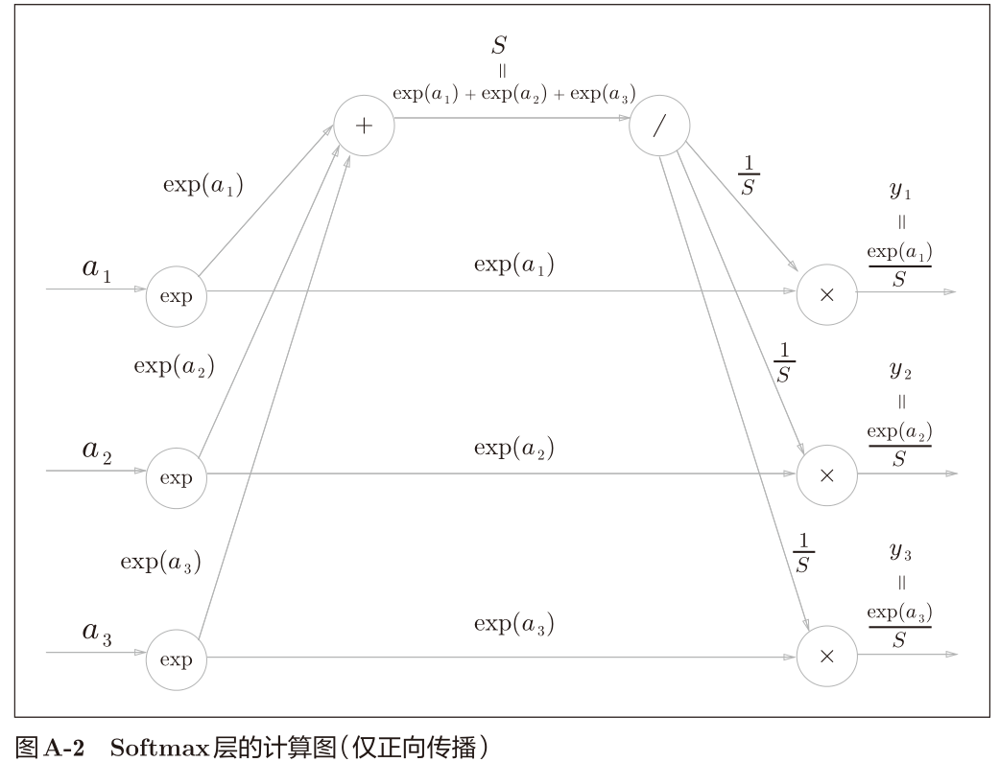
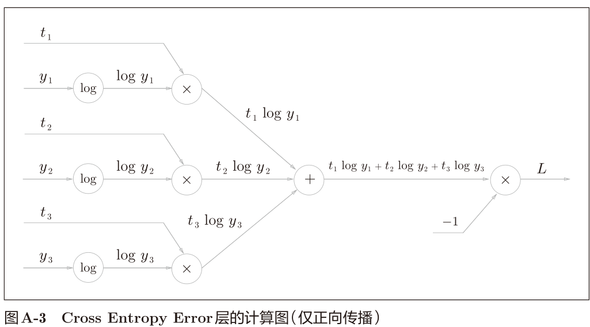
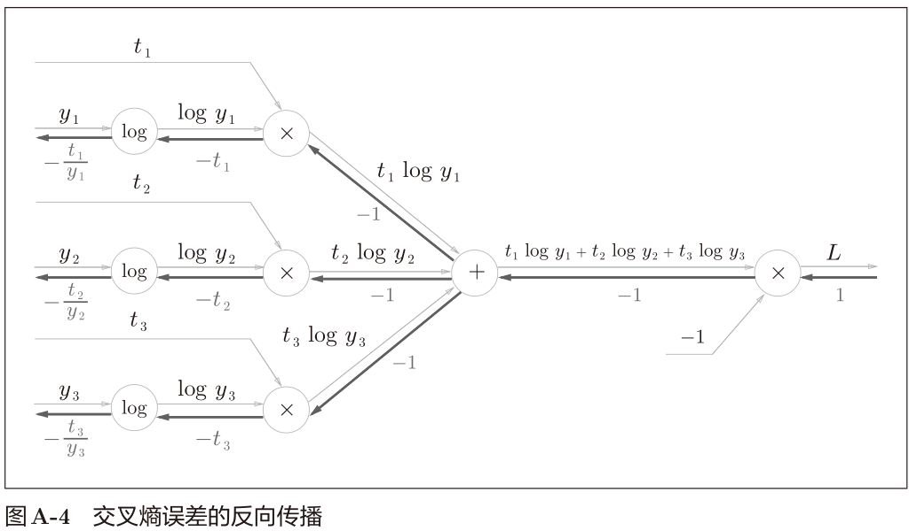
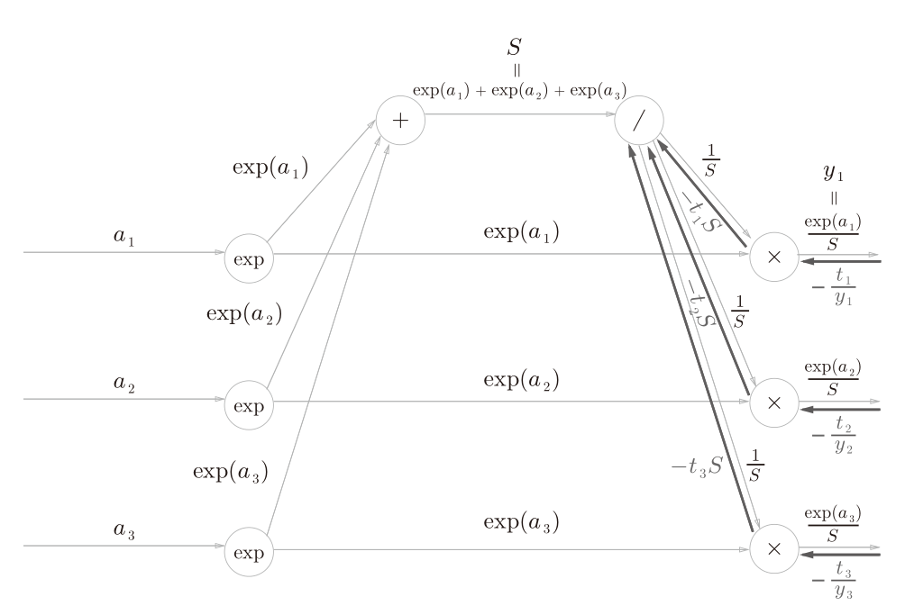
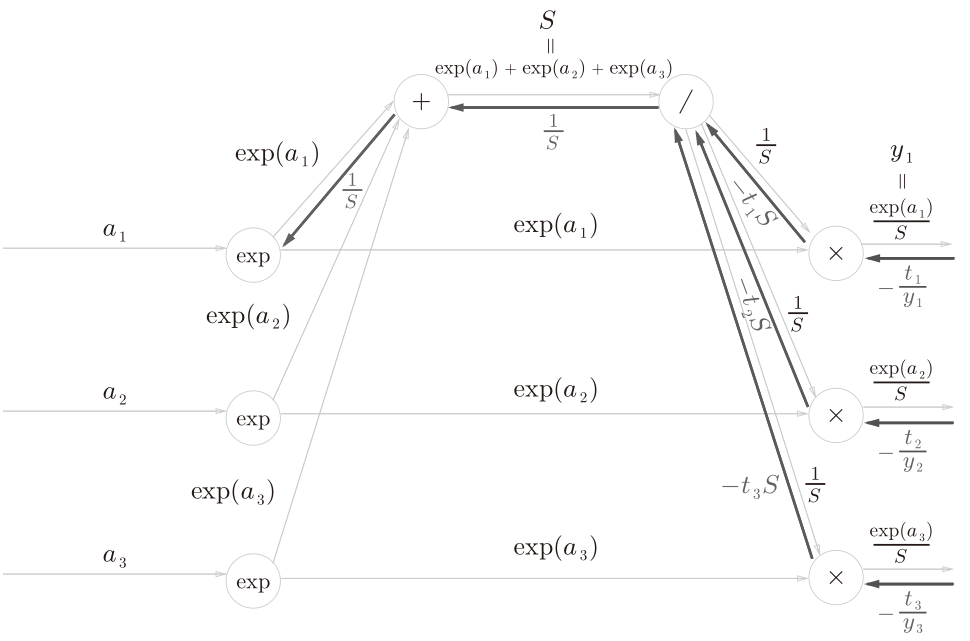
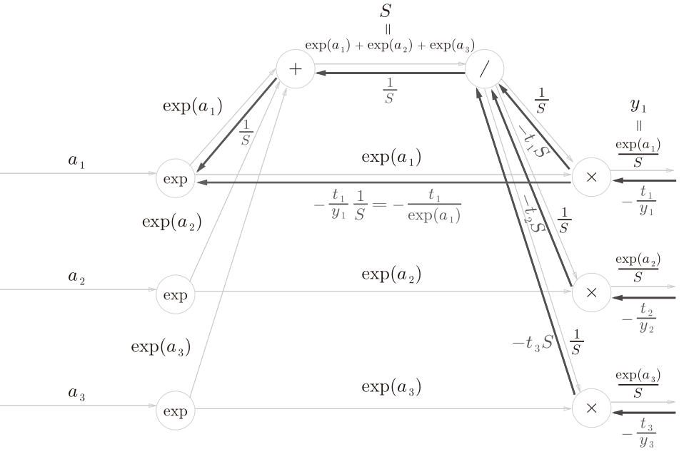
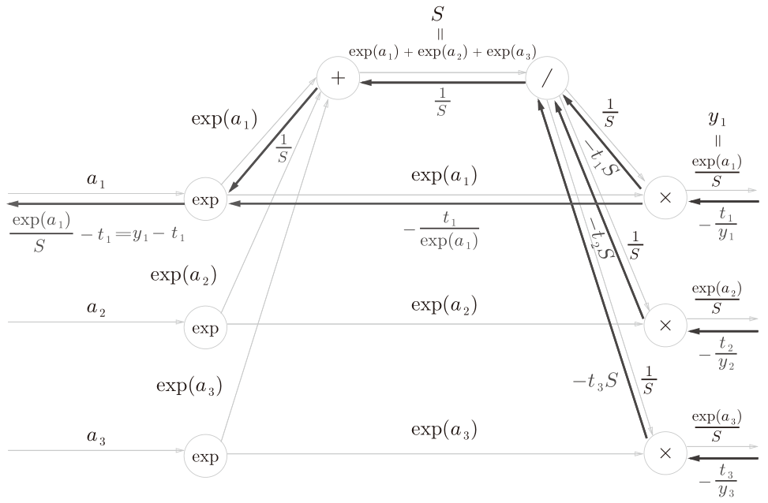

# Appendix A

softmax函数称为softmax层，交叉熵误差称为Cross Entropy Error层， 两者的组合称为 Softmax-with-Loss 层。

## 正向传播

Softmax层的函数：
$$
y_{k}=\frac{\exp \left(a_{k}\right)}{\sum_{i=1}^{n} \exp \left(a_{i}\right)}
$$
Cross Entropy Error层的函数：

$$
L=-\sum_k t_k*log(y_k)
$$

## 反向传播

Cross Entropy Error层

注意：

- log”节点的反向传播遵从下式

$$
\begin{array}{l}
y=\log x 
\\
\frac{\partial y}{\partial x}=\frac{1}{x}
\end{array}
$$

softmax层

$$
-\frac{t_{1}}{y_{1}} \exp \left(a_{1}\right)=-t_{1} \frac{S}{\exp \left(a_{1}\right)} \exp \left(a_{1}\right)=-t_{1} S
$$
正向传播时若有分支流出，则反向传播时它们的反向传播的值会相加。
因此，这里分成了三支的反向传播的值$(−t_1S, −t_2S, −t_3S)$会被求和。然后，
还要对这个相加后的值进行“/”节点的反向传播

计算步骤：
$$
[(−t_1S)+(−t_2S)+(−t_3S)]*(-S^{-2})=\\
-S(t_1+t_2+t_3)*(-S^{-2})=\\
S^{-1}(t_1+t_2+t_3)
$$
由于(t1, t2, t3)是教师标签，也是one-hot向量。one-hot向量意味着(t1, t2, t3)
中只有一个元素是1，其余都是0。因此，(t1, t2, t3)的和为1。于是，上式结果为：
$$
S^{-1}
$$
继续计算。

由于
$$
\begin{array}{l}
y=\exp (x) \\
\frac{\partial y}{\partial x}=\exp (x)
\end{array}
$$
于是
$$
[\frac{1}{S} +(-\frac{t_1}{exp(a_1)})]*exp(a_1)=\frac{exp(a_1)}{S} -t_1=y_1-t_1
$$
到了这步，终于计算完成了。剩下的a2、a3也可以按照相同的步骤求出来。