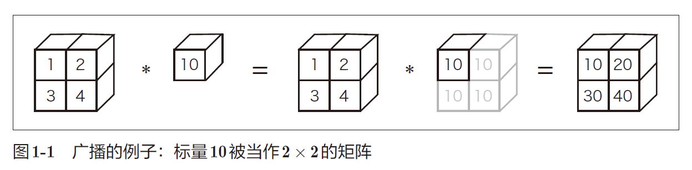
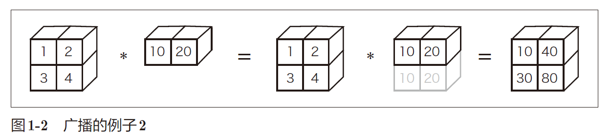

## 第一章 Python入门

- 基本语法

```python
x=1
a=[1,2,3,4,5] # list
me={'height':180} # dict
```

```python
class Man:
	def __init__(self, name):
		self.name = name
		print("Initialized!")
	def hello(self):
		print("Hello " + self.name + "!")
	def goodbye(self):
		print("Good-bye " + self.name + "!")
```

- NumPy 是用于数值计算的库，提供了很多高级的数学算法和便利的数组（矩阵）操作方法。

  

  

- Matplotlib 是用来画图的库。使用Matplotlib 能将实验结果可视化，并在视觉上确认深度学习运行期间的数据。

  ```python
  import numpy as np
  import matplotlib.pyplot as plt
  # 生成数据
  x = np.arange(0, 6, 0.1) # 以0.1为单位，生成0到6的数据
  y1 = np.sin(x)
  y2 = np.cos(x)
  # 绘制图形
  plt.plot(x, y1, label="sin")
  plt.plot(x, y2, linestyle = "--", label="cos") # 用虚线绘制
  plt.xlabel("x") # x轴标签
  plt.ylabel("y") # y轴标签
  plt.title('sin & cos') # 标题
  plt.legend()
  plt.show()
  ```