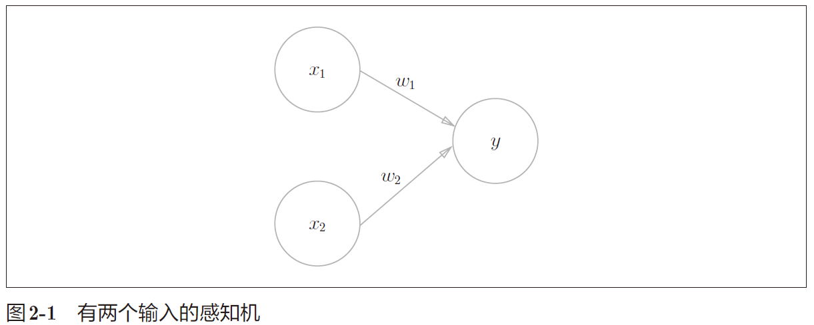
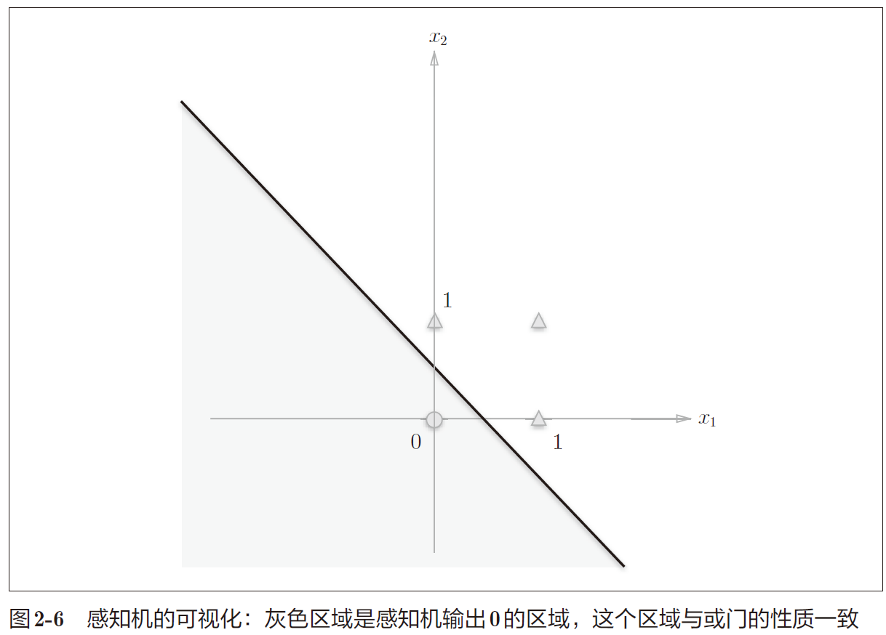
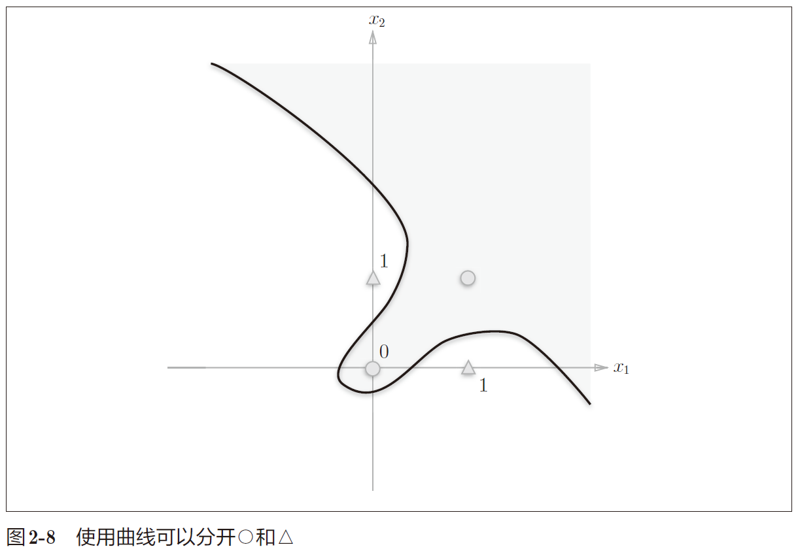
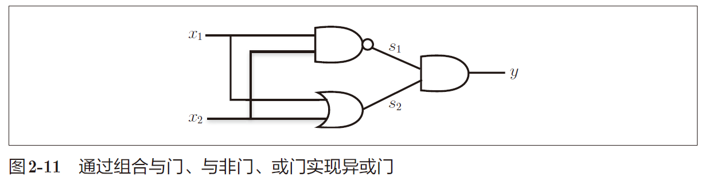
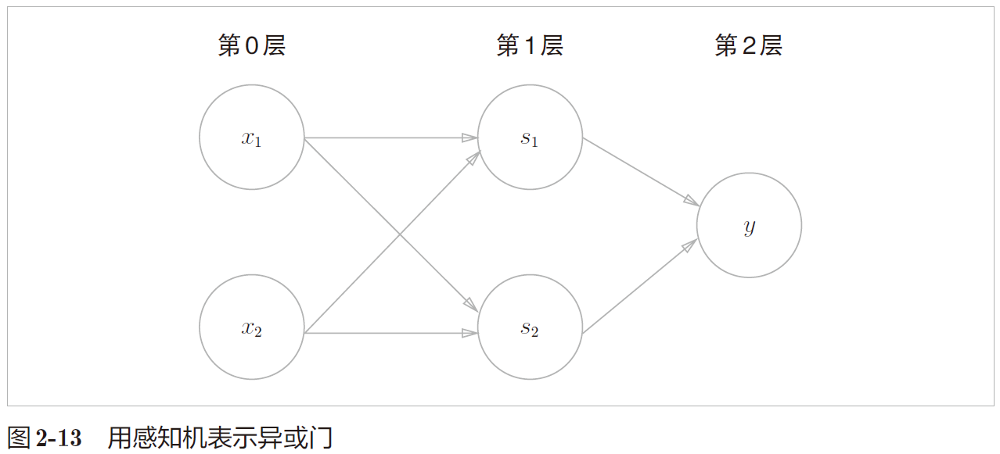

## 第二章 感知机

感知机是神经网络（深度学习）的起源的算法。


$$
y = \begin{cases} 0, & \text{$w_1x_1$+$w_2x_2$ $\leq$ θ} \\[2ex] 1, & \text{$w_1x_1$+$w_2x_2$ $\gt$ θ} \end{cases}
$$
x1、x2 是输入信号，y 是输出信号，w1、w2 是权重。输入信号被送往神经元时，被分别乘以固定的权（w1x1、w2x2）。神经元会计算传送过来的信号的总和，当总和超过某个界限值时，才会输出1。

根据上图的感知机来考虑简单的逻辑电路。

### 与门（AND gate）

| $$x_1$$ | $$x_2$$ | $$y$$ |
| ------- | ------- | ----- |
| 0       | 0       | 0     |
| 1       | 0       | 0     |
| 0       | 1       | 0     |
| 1       | 1       | 1     |

(w1, w2, θ) = (0.5, 0.5, 0.7) 时，可以满足条件。

### 与非门（NAND gate）

NAND是Not AND的含义，与非门就是颠倒了与门的输出。

| $$x_1$$ | $$x_2$$ | $$y$$ |
| ------- | ------- | ----- |
| 0       | 0       | 1     |
| 1       | 0       | 1     |
| 0       | 1       | 1     |
| 1       | 1       | 0     |

(w1, w2, θ) = (−0.5, −0.5, −0.7) 这样的组合（其他的组合无限存在）。只要把实现与门的参数值的符号取反，就可以实现与非门。

### 或门

| $$x_1$$ | $$x_2$$ | $$y$$ |
| ------- | ------- | ----- |
| 0       | 0       | 0     |
| 1       | 0       | 1     |
| 0       | 1       | 1     |
| 1       | 1       | 1     |

(w1, w2, θ) = (0.5, 0.5, 0.2)满足条件。

这里决定感知机参数的并不是计算机，而是我们人。我们看着真值表这种“训练数据”，人工考虑（想到）了参数的值。而机器学习的课题就是将这个决定参数值的工作交由计算机自动进行。学习是确定合适的参数的过程，而人要做的是思考感知机的构造（模型），并把训练数据交给计算机。

将上式的$$θ$$换成$$-b$$，变成更一般的形式：
$$
y = \begin{cases} 0, & \text{($b$ + $w_1x_1$+$w_2x_2$ $\leq$ 0)} \\[2ex] 1, & \text{($b$ + $w_1x_1$+$w_2x_2$ $\gt$ 0)} \end{cases}
$$
此处，b 称为偏置，w1 和w2 称为权重。

w1 和w2 是控制输入信号的重要性的参数，而偏置是调整神经元被激活的容易程度的参数。

与门、与非门、或门是具有相同构造的感知机，区别只在于权重参数的值。

### 单层感知机的局限

异或门也被称为逻辑异或电路。仅当x1 或x2 中的一方为1 时，才会输出1。

| $$x_1$$ | $$x_2$$ | $$y$$ |
| ------- | ------- | ----- |
| 0       | 0       | 0     |
| 1       | 0       | 1     |
| 0       | 1       | 1     |
| 1       | 1       | 0     |

前面介绍的感知机无法实现这个异或门。

或门的情况下，当权重参数(b, w1, w2) = (−0.5, 1.0, 1.0) 时，可满足真值表条件。
$$
y = \begin{cases} 0, & \text{($-0.5$ + $x_1$+$x_2$ $\leq$ 0)} \\[2ex] 1, & \text{($-0.5$ + $x_1$+$x_2$ $\gt$ 0)} \end{cases}
$$
生成由直线−0.5 + x1 + x2 = 0 分割开的两个空间。其中一个空间输出1，另一个空间输出0。



○表示0，△表示1。如果想制作或门，需要用直线将图中的○和△分开。实际上，刚才的那条直线就将这4 个点正确地分开了。
那么，异或门呢？能否像或门那样，用一条直线作出分割图2-7 中的○和△的空间呢？答案是否定的。
只能选取曲线将其分开。



单层感知机的局限性就在于它只能表示由一条直线分割的空间。曲线分割而成的空间称为**非线性空间**，由直线分割而成的空间称为**线性空间**。

### 多层感知机

通过组合感知机（叠加层）可以实现异或门（XOR）。



s1 为与非门（NAND），s2为或门（OR），然后使用与门（AND）将其组合起来。

| $$x_1$$ | $$x_2$$ | $$s_1$$(NAND) | $$s_2$$(OR) | $$y$$ |
| ------- | ------- | ------------- | ----------- | ----- |
| 0       | 0       | 1             | 0           | 0     |
| 1       | 0       | 1             | 1           | 1     |
| 0       | 1       | 1             | 1           | 1     |
| 1       | 1       | 0             | 1           | 0     |

```python
def XOR(x1, x2):
    s1 = NAND(x1, x2)
    s2 = OR(x1, x2)
    y = AND(s1, s2)
    return y
```



异或门是一种多层结构的神经网络。将最左边的一列称为第 0 层，中间的一列称为第 1 层，最右边的一列称为第 2 层。

通过叠加层（加深层），感知机能够进行非线性的表示。多层感知机（在理论上）可以表示计算机。