## 第三章 神经网络

神经网络的一个重要性质是可以自动地从数据中学习到合适的权重参数。

### 激活函数

将之前的函数写成更简洁的形式：
$$
y=h(b+w_1x_1+w_2x_2)
$$

$$
h(x)=\begin{cases} 0, & \text{($x$ $\leq$ 0)} \\[2ex] 1, & \text{($x$ $\gt$ 0)} \end{cases}
$$

h（x）函数会将输入信号的总和转换为输出信号，这种函数称为激活函数（activation function）。

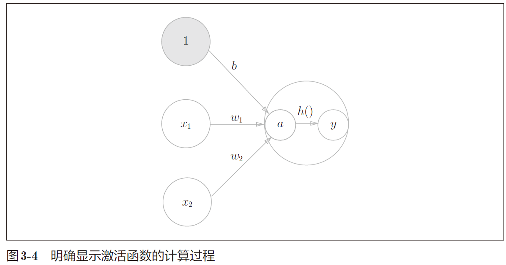

#### 阶跃函数

阶跃函数的numpy实现：

```python
def step_function(x):
    y = x > 0 # array([False, True, True], dtype=bool)
    return y.astype(np.int) # True -> 1, False ->0
```

阶跃函数的图形：

```python
import numpy as np
import matplotlib.pylab as plt

def step_function(x):
	return np.array(x > 0, dtype=np.int)
x = np.arange(-5.0, 5.0, 0.1)
y = step_function(x)
plt.plot(x, y)
plt.ylim(-0.1, 1.1) # 指定y轴的范围
plt.show()
```

#### sigmoid

神经网络中经常使用的一个激活函数是 sigmoid 函数（sigmoid function）。
$$
h(x)=\frac{1}{1+exp(-x)}
$$
exp(−x)表示e<sup>-x</sup>。

sigmoid函数的实现：

```python
def sigmoid(x):
    return 1 / (1 + np.exp(-x))
```

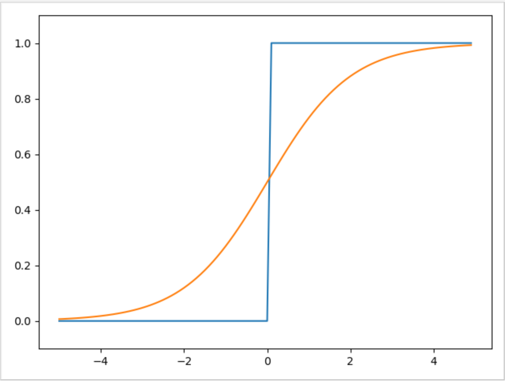

感知机中神经元之间流动的是 0 或 1 的二元信号，而神经网络中流动的是连续的实数值信号。

共同点：

- 输入小时，输出接近0（为0）；随着输入增大，输出向1 靠近（变成1）”。
- 值域在[0,1]。
- 都是非线性函数（线性函数为h(x) = cx。c 为常数）。

**神经网络的激活函数必须使用非线性函数**。

线性函数的问题在于，不管如何加深层数，总是存在与之等效的“无隐藏层的神经网络”。

考虑把线性函数h(x) = cx 作为激活函数，把y(x) = h(h(h(x))) 的运算对应 3 层神经网络A。这个运算会进行y(x) = c × c × c × x 的乘法运算，但是同样的处理可以由y(x) = ax（注意，$$a = c^3$$）这一次乘法运算（即没有隐藏层的神经网络）来表示。

#### ReLU函数

ReLU（Rectified Linear Unit）函数：
$$
h(x)=\begin{cases}x,&\text{$x$ $\gt$ 0}  \\[2ex]0,& \text{$x$ $\leq$ 0}\end{cases}
$$
ReLU函数在输入大于0 时，直接输出该值；在输入小于等于0 时，输出0。

```python
def relu(x):
 	return np.maximum(0, x)
```

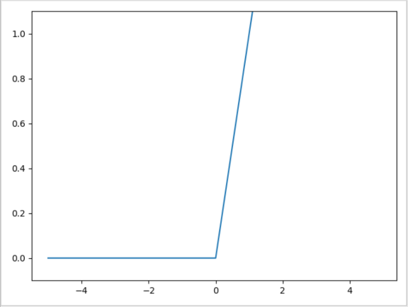

### 多维数组的运算

```python
np.ndim() # 获取维度
A.shape  # 获取数组形状
```

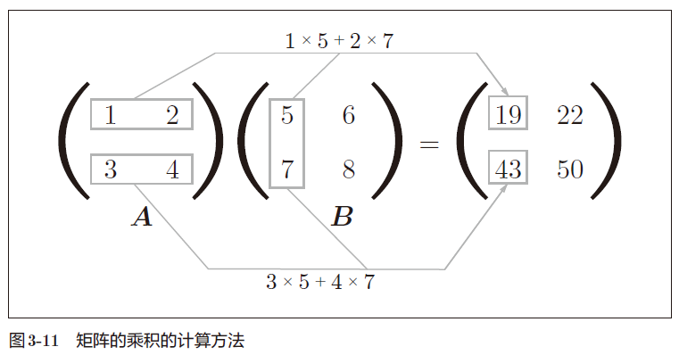

矩阵的乘积运算中，操作数（A、B）的顺序不同，结果也会不同。

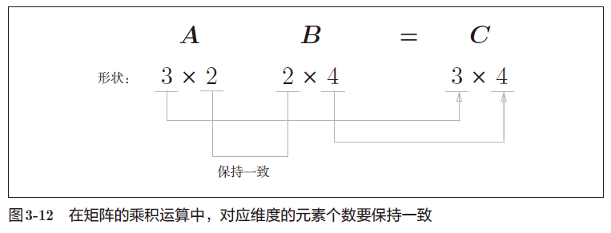

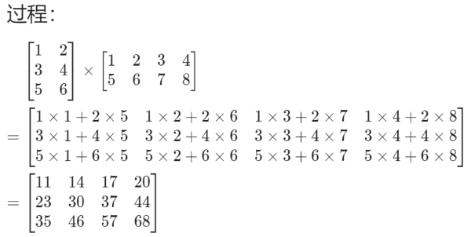

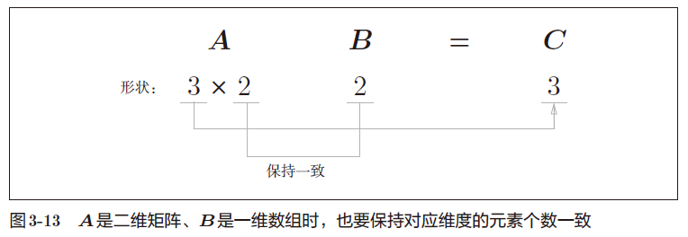

np.dot(X, W) 可以计算矩阵的点积。

### 3层神经网络的实现

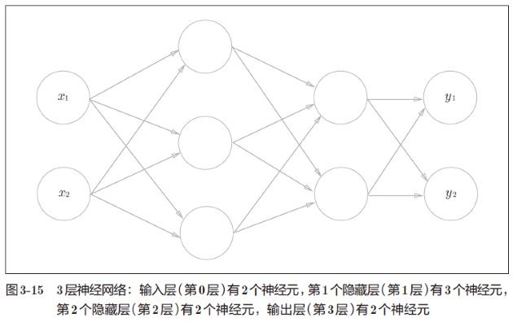

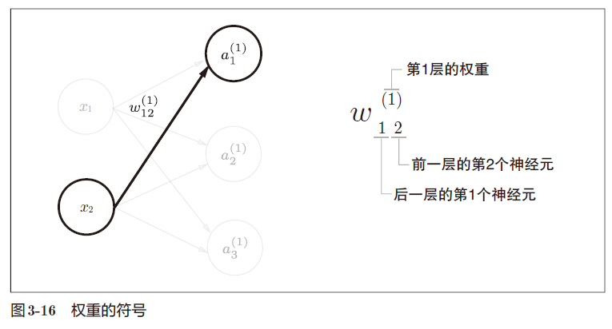

神经元$$a_1$$<sup>(1)</sup>的右上角有一个“(1)”，表示神经元的层号为第 1 层。

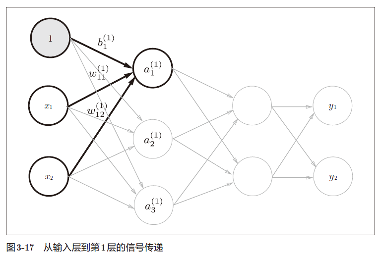
$$
a^{(1)}_{1}=w^{(1)}_{11}x_{1}+w^{(1)}_{12}x_{2}+b^{1}_{1}
$$
第一层的加权和可以表示成：
$$
A^{(1)}=XW^{(1)}+B^{(1)}
$$
其中：
$$
A^{(1)}=(a^{(1)}_{1}\ a^{(1)}_{2}\ a^{(1)}_{2}),
\\
X=(x_{1}\ x_{2}),
\\
B^{(1)}=(b^{(1)}_{1}\ b^{(1)}_{2} \ b^{(1)}_{3}),
\\
W^{(1)}=(\begin{matrix}
w^{(1)}_{11} & w^{(1)}_{21} & w^{(1)}_{31} \\
w^{(1)}_{12} & w^{(1)}_{22} & w^{(1)}_{32}
\end{matrix})
$$
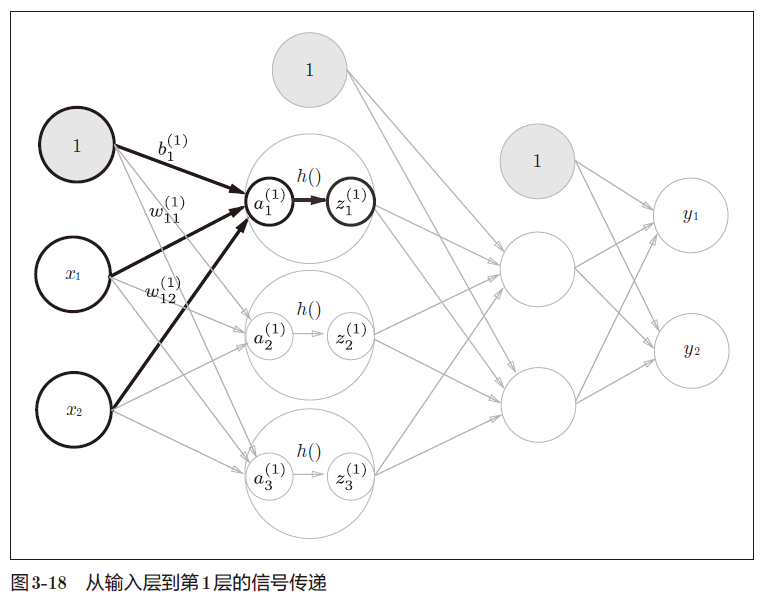

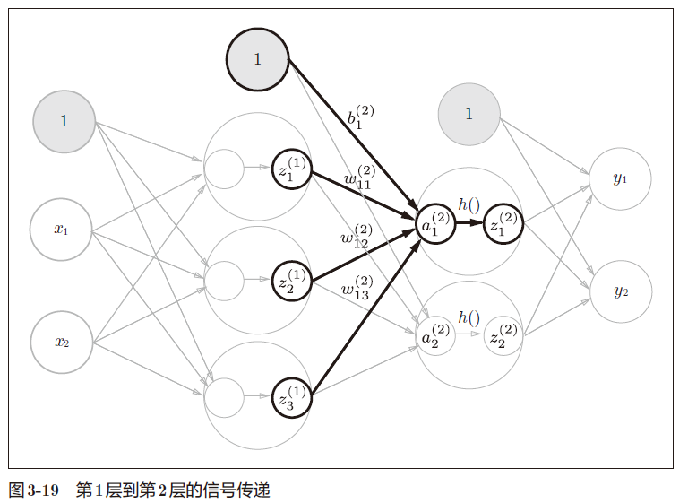

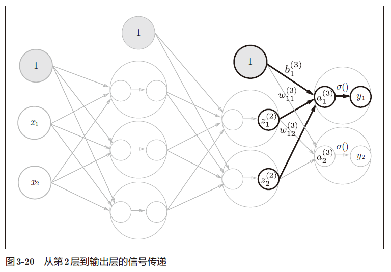

神经网络可以用在分类问题和回归问题上，不过需要根据情况改变输出层的激活函数。一般而言，回归问题用恒等函数，分类问题用softmax 函数。

softmax 函数：
$$
y_{k}=\frac{exp(a_{k})}
{
\begin{equation*}
\sum_{i=1}^nexp(a_{i})
\end{equation*}
}
$$
exp(x) 是表示$$e^{x}$$的指数函数。

softmax函数的实现：

```python
def softmax(a):
    exp_a = np.exp(a)
    sum_exp_a = np.sum(exp_a)
    y = exp_a / sum_exp_a
    return y
```

由于exp(a)当a很大时会溢出，所以可以进行改进：
$$
y_{k}=\frac{exp(a_{k})}{\begin{equation*}\sum_{i=1}^nexp(a_{i})\end{equation*}}=
\frac{Cexp(a_{k})}{\begin{equation*}C\sum_{i=1}^nexp(a_{i})\end{equation*}}=
\frac{exp(a_{k}+logC)}{\begin{equation*}\sum_{i=1}^nexp(a_{i}+logC)\end{equation*}}=
\frac{exp(a_{k}+C^{'})}{\begin{equation*}\sum_{i=1}^nexp(a_{i}+C^{'})\end{equation*}}
$$
思路是让$$a_{i}+C^{'}$$尽可能小，所以替换为$$a_{i}-\max(a_{i})$$

```python
def softmax(a):
    c = np.max(a)
    exp_a = np.exp(a - c)
    sum_exp_a = np.sum(exp_a)
    y = exp_a / sum_exp_a
    return y
```

softmax函数的输出是0.0 到1.0之间的实数。并且，softmax函数的输出值的总和是1。正因为这个性质，可以把softmax 函数的输出解释为“概率“。

“学习”是指使用训练数据、自动调整参数的过程。

使用神经网络解决问题时，先使用训练数据（学习数据）进行权重参数的学习；进行推理时，使用学习到的参数，对输入数据进行分类。

### 手写数字识别

MNIST数据集是由 0 到9 的数字图像构成。MNIST的图像数据是 28 像素 × 28 像素的灰度图像（1 通道），各个像素的取值在 0 到 255 之间。每个图像数据都相应地标有“7”“2”“1”等标签。

下载地址：http://yann.lecun.com/exdb/mnist/

网络不好时建议使用迅雷下载到本地，并手动注释掉minist.py中download_mnist() 该行防止继续下载。

Python 中 pickle 可以将程序运行中的对象保存为文件。如果加载保存过的pickle 文件，可以立刻复原之前程序运行中的对象。

- 把数据限定到某个范围内的处理称为正规化（normalization）。
- 对神经网络的输入数据
  进行某种既定的转换称为预处理（pre-processing）。
- 将数据整体的分布形状均匀化的方法，即数据白化（whitening）。

```python
def get_data():
    (x_train, t_train), (x_test, t_test) = load_mnist(normalize=True, flatten=True, one_hot_label=False)
    return x_test, t_test

def init_network():
    with open("sample_weight.pkl", 'rb') as f:
        network = pickle.load(f)
    return network

def predict(network, x):
    W1, W2, W3 = network['W1'], network['W2'], network['W3']
    b1, b2, b3 = network['b1'], network['b2'], network['b3']

    a1 = np.dot(x, W1) + b1
    z1 = sigmoid(a1)
    a2 = np.dot(z1, W2) + b2
    z2 = sigmoid(a2)
    a3 = np.dot(z2, W3) + b3
    y = softmax(a3)

    return y

x, t = get_data()
network = init_network()
accuracy_cnt = 0
for i in range(len(x)):
    y = predict(network, x[i]) #输出[0.1,0.3,0.2,...,0.04]，表示“0”的概率为0.1等
    p= np.argmax(y) # 获取概率最高的元素的索引
    if p == t[i]:
        accuracy_cnt += 1

print("Accuracy:" + str(float(accuracy_cnt) / len(x)))
```

单数据处理：

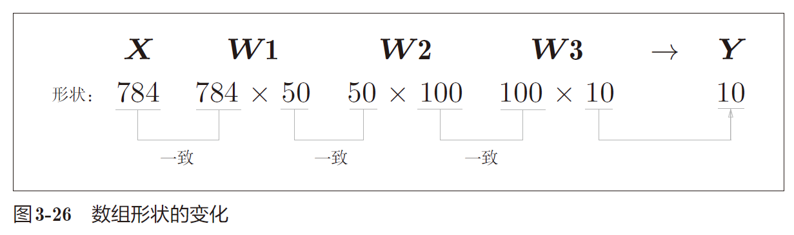

输入：一个由784 个元素（28 × 28 的二维数组）构成的一维数组；输出：一个有10 个元素的一维数组。

假设将x的形状改为100 × 784，将
100 张图像打包作为输入数据，那么一次就可以处理100个数据。

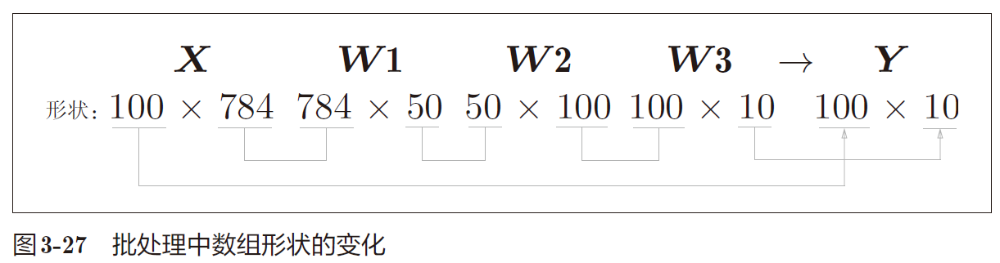

x[0] 和
y[0]中保存了第 0 张图像及其推理结果，x[1]和y[1]中保存了第 1 张图像及
其推理结果。

小结：

关于输出层的激活函数，回归问题中一般用恒等函数，分类问题一般用 softmax 函数。

分类问题中，输出层的神经元的数量设置为要分类的类别数。