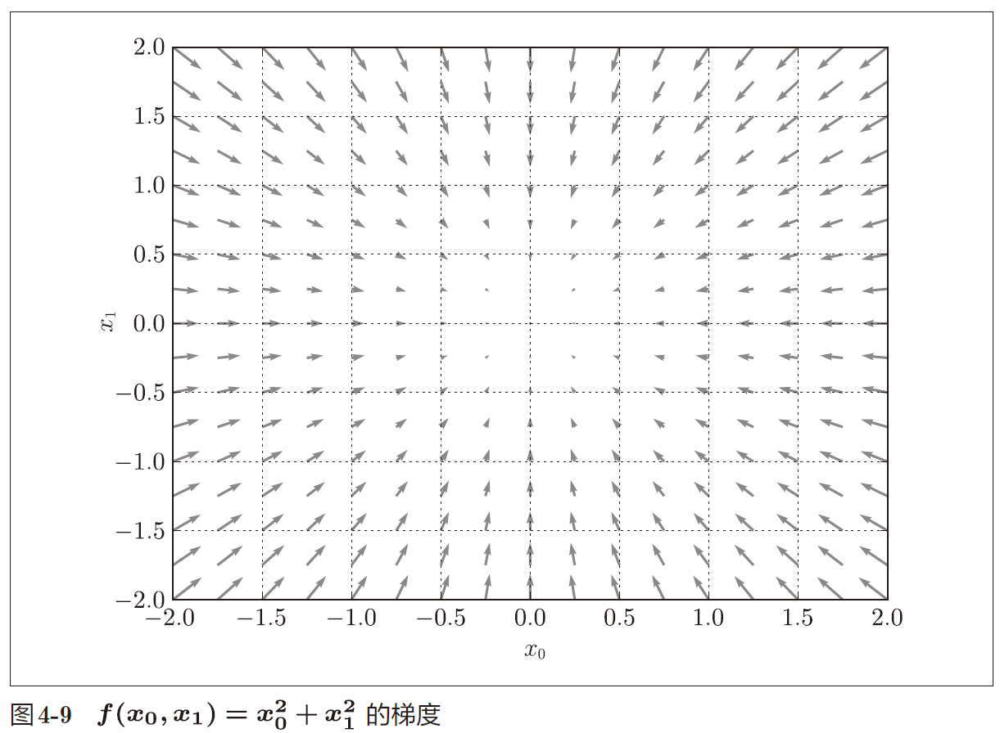

## 第四章 神经网络的学习

“学习”是指从训练数据中自动获取最优权重参数的过程。以损失函数为基准，利用函数斜率的梯度法。

### 损失函数

针对单个数据的损失函数：

均方误差
$$
E=\frac{1}{2}{\begin{equation*}\sum_{k}(y_k-t_k)^2\end{equation*}}
$$
交叉熵误差
$$
E=-{\begin{equation*}\sum_{k}t_klog{y_k}\end{equation*}}
$$
针对所有训练数据的平均损失函数：
$$
E=-\frac{1}{N}{\begin{equation*}\sum_{n}\sum_{k}t_klog{y_k}\end{equation*}}
$$
MNIST 数据：训练数据有60000 个，输入数据是784 维
（28 × 28）的图像数据，监督数据是10 维的数据。因此，x_train、t_
train的形状分别是(60000, 784)和(60000, 10)。

np.random.choice(60000, 10) 会从0 到59999 之间随机选择10 个数字。根据这个，从训练数据中随机抽取10 笔数据。

思路：用随机选择的小批量数据（mini-batch）作为全体训练数据的近似值。

y[np.arange(batch_size),
t]能抽出各个数据的正确解标签对应的神经网络的输出。

例如当batch_size为 5
时，np.arange(batch_size) 会生成一个 NumPy 数组[0, 1, 2, 3, 4]。因为
t 中标签是以[2, 7, 0, 9, 4]的形式存储的，会生成NumPy 数组[y[0,2], y[1,7], y[2,0],
y[3,9], y[4,4]]。

阶跃函数的斜率在绝大多数地方都为0，而sigmoid函
数的斜率（切线）不会为0。

### 导数

解析性求导得到的导数是不含误差的“真的导数“。

而利用微小的差分求导数的过程称为数值微分：

- 中心差分：函数 f 在(x + h) 和(x − h) 之间的差分。

  ```python
  def numerical_diff(f, x):
  	h = 1e-4 # 0.0001
  	return (f(x+h) - f(x-h)) / (2*h)
  ```

  使用该方法计算得到的结果和解析性求导的结果很接近。

- 前向差分：函数 f 在(x + h) 和x之间的差分。

### 偏导数

将多个变量中的某一个变量定为目标变量，并将其他变量固定为某个值。符号为∂f。

### 梯度

全部由偏导数汇总而成的向量称为梯度（gradient）。

```python
def _numerical_gradient_no_batch(f, x):
    h = 1e-4 # 0.0001
    grad = np.zeros_like(x)
    
    for idx in range(x.size):
        tmp_val = x[idx]
        x[idx] = float(tmp_val) + h
        fxh1 = f(x) # f(x+h)
        
        x[idx] = tmp_val - h 
        fxh2 = f(x) # f(x-h)
        grad[idx] = (fxh1 - fxh2) / (2*h)
        
        x[idx] = tmp_val # 还原值
        
    return grad
```

梯度指示的方向是各点处的函数值减小最多的方向。



神经网络（深度学习）中，梯度法主要是指梯度下降法。

梯度法的数学公式：
$$
x_0=x_0-η\frac{∂f}{∂x_0}
\\
x_1=x_1-η\frac{∂f}{∂x_1}
$$
η 表示更新量，在神经网络的学习中，称为学习率（learning
rate）。整个式子表示的是逐步减少函数的值。

梯度下降法的代码实现：

```python
def gradient_descent(f, init_x, lr=0.01, step_num=100):
	x = init_x
	for i in range(step_num):
		grad = numerical_gradient(f, x) 
		x -= lr * grad # 每次下降的梯度值：lr * 梯度
	return x
```

参数f 是要进行最优化的函数，init_x 是初始值，lr 是学习率，step_num 是梯度法的重复次数。numerical_gradient(f,x) 会求函数的梯度，用该梯度乘以学习率得到的值进行更新操作，由step_num 指定重复的
次数。

学习率一般是人工设置和调整的，这点和权重和偏置不一样。

神经网络的梯度跟W很相似：
$$
W=(\begin{matrix}
w_{11} & w_{21} & w_{31} \\
w_{12} & w_{22} & w_{32}
\end{matrix})

\\
\frac{∂L}{∂W}=(\begin{matrix}
\frac{∂L}{w_{11}} & \frac{∂L}{w_{12}} & \frac{∂L}{w_{13}} \\
\frac{∂L}{w_{21}} & \frac{∂L}{w_{22}} & \frac{∂L}{w_{23}}
\end{matrix})
$$

$\frac{∂L}{w_{11}}$的值大约是0.2，表示如果将$w_{11}$ 增加h，那么损失函数的值会增加0.2h。

再如， $\frac{∂L}{w_{23}}$对应的值大约是−0.5，表示如果将 $w_{23}$ 增加h，损失函数的值将减小0.5h。

因此，从减小损失函数值的观点来看，$w_{23}$ 应向正方向更新，$w_{11}$应向负方向更新。至于更新的程度，$w_{23}$ 比$w_{11}$的贡献要大，因为绝对值较大。

### 随机梯度下降法（SGD)

- 步骤一：从训练数据中随机挑选一部分作为mini-batch。
- 步骤二：求出各个权重参数的梯度。
- 步骤三：将权重参数沿梯度方向进行微小更新。
- 步骤四：重复步骤1~3

### mini-batch的实现

epoch是一个单位。一个epoch表示学习中所有训练数据均被使用过
一次时的更新次数。比如，对于10000 笔训练数据，用大小为100
笔数据的mini-batch 进行学习时，重复随机梯度下降法100 次，所有的训练数据就都被“看过”了。此时，epoch为100。