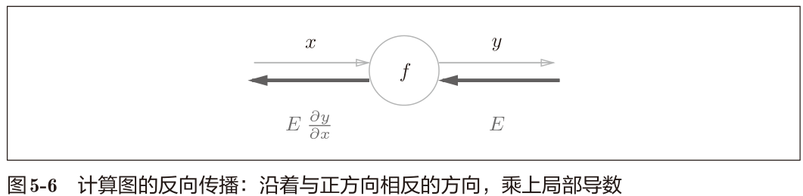
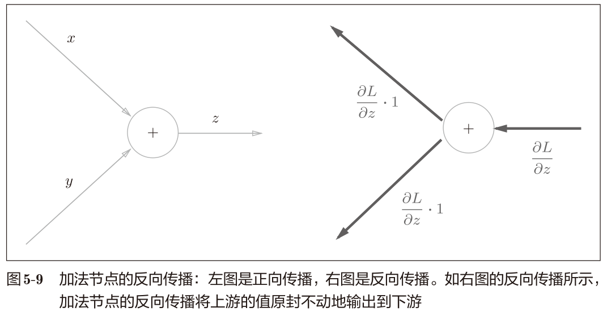
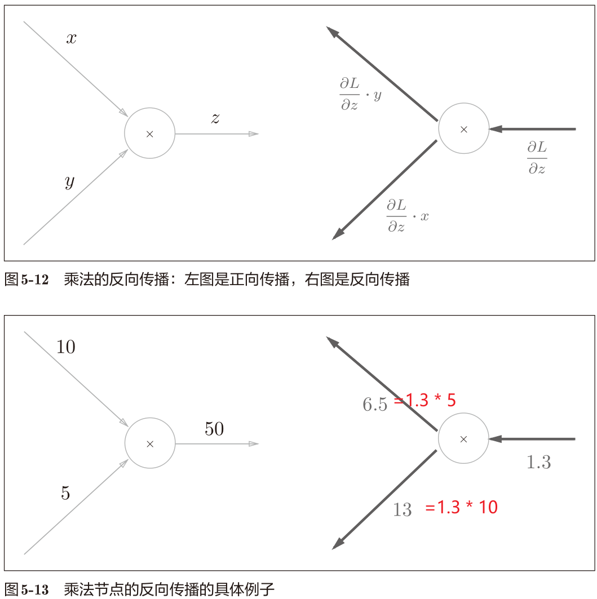
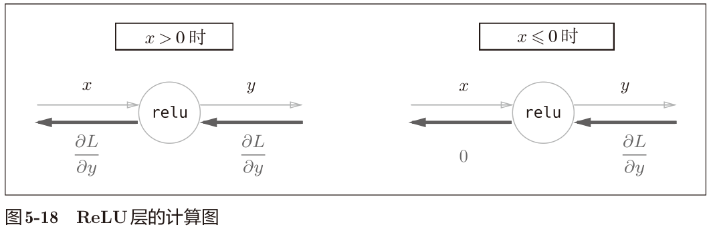

## 第5章 误差反向传播法

### 计算图
正确理解误差反向传播法，我个人认为有两种方法：
- 一种是基于数学式；
- 另一种是基于计算图（computational graph）。利于直观上的理解。

用计算图解题的情况下，需要按如下流程进行。
1. 构建计算图。
2. 在计算图上，从左向右进行计算

第2歩“从左向右进行计算”是正向传播（forward propagation）。正向传播是从计算图出发点到结束点的传播。
也有反向传播（backward propagation）。反向传播将在接下来的导数计算中发挥重要作用。

#### 计算图的优点
- 局部计算。通过局部计算使各个节点致力于简单的计算，简化问题。
- 通过反向传播高效计算导数。

#### 思考问题：苹果价格上涨对总体付费金额的影响
> 想知道苹果价格的上涨会在多大程度上影响最终的支付金额，即求“支付金额关于苹果的价格的导数”

$$
\frac{\mathrm{d}L}{\mathrm{d}x}
$$


反向传播使用与正方向相反的箭头（粗线）表示。反向传播传递“局部导数”，将导数的值写在箭头的下方。

在这个例子中，反向传播从右向左传递导数的值（1 → 1.1 → 2.2）。从结果中可知，“支付金额关于苹果的价格的导数”的值是2.2。意味着，如果苹果的价格上涨1日元，
最终的支付金额会增加2.2日元。

综上，计算图的优点是，可以通过正向传播和反向传播高效地计算各个变量的导数值。

### 链式法则



反向传播的计算顺序是，将信号 E 乘以节点的局部导数
（$ \frac{\mathrm{∂}y}{\mathrm{∂}x} $），然后将结果传递给下一个节点。这里所说的局部导数是指正向传播
中y = f(x)的导数，也就是y关于x的导数（ $ \frac{\mathrm{∂}y}{\mathrm{∂}x} $）

反向计算的顺序，加上链式法则，于是可以高效计算导数。

链式法则是关于复合函数的导数的性质，定义如下。

> 如果某个函数由复合函数表示，则该复合函数的导数可以用构成复合函数的各个函数的导数的乘积表示。

$$
z = t^2
\\
t = x + y
$$

$$
 \frac{\mathrm{∂}z}{\mathrm{∂}x} =
 \frac{\mathrm{∂}z}{\mathrm{∂}t} *
 \frac{\mathrm{∂}t}{\mathrm{∂}x} =
2t*1=2(x+y)
$$

#### 链式法则和计算图


代入计算


### 反向传播

#### 加法节点的反向传播

假设有公式, z = x + y。那么
$$
\frac{\mathrm{∂}z}{\mathrm{∂}x} =1
\\
 \frac{\mathrm{∂}z}{\mathrm{∂}y} =1
$$
加法节点的反向传播只乘以1，所以输入的值会原封不动地流向下一个节点。



本例中把从上游传过来的导数的值设为
$\frac{\mathrm{∂}L}{\mathrm{∂}z}$。这是因为我们假定了一个最终输出值为L的大型计算图。z = x + y的计算位于这个大型计算图的某个地方，从上游会传来$\frac{\mathrm{∂}L}{\mathrm{∂}z}$的值，并向下游传递
$\frac{\mathrm{∂}L}{\mathrm{∂}x}$和
$\frac{\mathrm{∂}L}{\mathrm{∂}y}$。


#### 乘法节点的反向传播

考虑 z = xy。
$$
 \frac{\mathrm{∂}z}{\mathrm{∂}x} =y
\\
 \frac{\mathrm{∂}z}{\mathrm{∂}y} =x
$$
乘法的反向传播会将上游的值乘以正向传播时的输入信号的“翻转值”
后传递给下游。



另外，加法的反向传播只是将上游的值传给下游，
并不需要正向传播的输入信号。但是，乘法的反向传播需要正向传播时的输入信号值。因此，实现乘法节点的反向传播时，要保存正向传播的输入信号。

#### 苹果的例子


反向传播的计算细节：从右往左
$$
1= 220/220
\\
1.1=1*1.1
\\
200=1*200
\\
110=1.1*100
\\
2.2=1.1*2
$$

#### 练习


$$
A=1\\
B=1.1*1=1.1\\
I=650*1=650\\
C=1.1\\
D=1.1\\
E=1.1*100=110\\
F=1.1*1=2.2\\
G=1.1*3=3.3\\
H=1.1*150=165
$$

### 简单层的实现
#### 乘法层
```python
class MulLayer:
    def __init__(self):
        self.x = None
        self.y = None

    def forward(self, x, y):
        self.x = x
        self.y = y                
        out = x * y

        return out

    def backward(self, dout):
        dx = dout * self.y
        dy = dout * self.x

        return dx, dy
```
#### 加法层
```python
class AddLayer:
    def __init__(self):
        pass

    def forward(self, x, y):
        out = x + y

        return out

    def backward(self, dout):
        dx = dout * 1
        dy = dout * 1

        return dx, dy
```

例子代码参考：

- `buy_apple.py`
- `buy_apple_orange.py`

### 激活函数层的实现

#### ReLU

$$
y=\left\{\begin{array}{ll}
x & (x>0) \\
0 & (x \leqslant 0)
\end{array}\right.
$$

$$
\frac{\partial y}{\partial x}=\left\{\begin{array}{ll}
1 & (x>0) \\
0 & (x \leqslant 0)
\end{array}\right.
$$

如果正向传播时的输入x大于0，则反向传播会将上游的
值原封不动地传给下游。反过来，如果正向传播时的x小于等于0，则反向
传播中传给下游的信号将停在此处。



```python
class Relu:
    def __init__(self):
        self.mask = None

    def forward(self, x):
        self.mask = (x <= 0)
        out = x.copy()
        out[self.mask] = 0

        return out

    def backward(self, dout):
        dout[self.mask] = 0
        dx = dout

        return dx
```

out[self.mask] = 0 表示正向传播时，如果你是<=0的分量，那么你传播不到右边。

dout[self.mask] = 0 表示反向传播时，如果你是<=0的分量，那么你也传播不到左边。

> ReLU层的作用就像电路中的开关一样。正向传播时，有电流通过
> 的话，就将开关设为ON；没有电流通过的话，就将开关设为OFF。
> 反向传播时，开关为ON的话，电流会直接通过；开关为OFF的话，
> 则不会有电流通过

#### Sigmoid

$$
y=\frac{1}{1+\exp (-x)}
$$


/ 节点表示 y =1/x ,导数：$\frac{\partial y}{\partial x} =-\frac{1}{x^2} =-y^2$。

完整计算步骤如下：


归约中间过程：


进一步整理公式
$$
\begin{aligned}
\frac{\partial L}{\partial y} y^{2} \exp (-x) &=\frac{\partial L}{\partial y} \frac{1}{(1+\exp (-x))^{2}} \exp (-x) \\
&=\frac{\partial L}{\partial y} \frac{1}{1+\exp (-x)} \frac{\exp (-x)}{1+\exp (-x)} \\
&=\frac{\partial L}{\partial y} y(1-y)
\end{aligned}
$$
这样，就可以给出代码实现

```python
class Sigmoid:
    def __init__(self):
        self.out = None

    def forward(self, x):
        out = sigmoid(x)
        self.out = out
        return out

    def backward(self, dout):
        dx = dout * (1.0 - self.out) * self.out # self.out=上图的y

        return dx
```

### Affine/Softmax层的实现

> Affine在几何学领域被称为仿射变换。

#### Affine层

```bash
>>> X = np.random.rand(2) # 输入
>>> W = np.random.rand(2,3) # 权重
>>> B = np.random.rand(3) # 偏置
>>>
>>> X.shape # (2,)
>>> W.shape # (2, 3)
>>> B.shape # (3,)
>>>
>>> Y = np.dot(X, W) + B
```

考虑计算图的反向传播
$$
\begin{aligned}
\frac{\partial L}{\partial \boldsymbol{X}} &=\frac{\partial L}{\partial \boldsymbol{Y}} \cdot \boldsymbol{W}^{\mathrm{T}} \\
\frac{\partial L}{\partial \boldsymbol{W}} &=\boldsymbol{X}^{\mathrm{T}} \cdot \frac{\partial L}{\partial \boldsymbol{Y}} 
\end{aligned}\tag{5.13}
$$

> 5.13公式的推导。矩阵转置如何来的？下面会说明，不要着急。

$W^T$的T表示转置。转置操作会把W的元素(i, j)换成元素
(j, i).。

举例
$$
\begin{array}{c}
\boldsymbol{W}=\left(\begin{array}{lll}
w_{11} & w_{12} & w_{13} \\
w_{21} & w_{22} & w_{23}
\end{array}\right) \\
\boldsymbol{W}^{\mathrm{T}}=\left(\begin{array}{ll}
w_{11} & w_{21} \\
w_{12} & w_{22} \\
w_{13} & w_{23}
\end{array}\right)
\end{array}
$$
Affine层的反向传播


> 疑惑的部分在于红线框的部分如何推导出来的？

先考虑矩阵的形状
$$
\begin{array}{l}
\boldsymbol{X}=\left(x_{0}, x_{1}, \cdots, x_{n}\right) \\
\frac{\partial L}{\partial \boldsymbol{X}}=\left(\frac{\partial L}{\partial x_{0}}, \frac{\partial L}{\partial x_{1}}, \cdots, \frac{\partial L}{\partial x_{n}}\right)
\end{array}
$$
 比如  , $\frac{\partial L}{\partial Y}$  的形状是
 (3,), W  的形状是 (2,3) 时，思考  $\frac{\partial L}{\partial Y}  $和  $\boldsymbol{W}^{\mathrm{T}} $ 的乘积，使得  $\frac{\partial L}{\partial \boldsymbol{X}}$  的形状为  (2,) 。

这样就自然而然地推导出式  (5.13)。同理，$\frac{\partial L}{\partial W}$的推导也就出来了。

> 矩阵的乘积（“dot”节点）的反向传播可以通过组建使矩阵对应维度的元素个数一
> 致的乘积运算而推导出来。

#### 批版本的Affine层

前面介绍的Affine层的输入X是以单个数据为对象的。现在我们考虑N
个数据一起进行正向传播的情况，也就是批版本的Affine层。也就是前面的N=1，现在我们要考虑N>1的情况。


加上偏置时，需要特别注意。正向传播时，偏置被加到X·W的各个
数据上。比如，N = 2（数据为2个）时，偏置会被分别加到这2个数据.

```python
>>> X_dot_W = np.array([[0, 0, 0], [10, 10, 10]])
>>> B = np.array([1, 2, 3])
>>>
>>> X_dot_W
array([[ 0, 0, 0],
[ 10, 10, 10]])
>>> X_dot_W + B
array([[ 1, 2, 3],
[11, 12, 13]])
```

正向传播时，偏置会被加到每一个数据（第1个、第2个……）上。因此，
反向传播时，各个数据的反向传播的值需要汇总为偏置的元素。

> 反向传播时，各个数据的反向传播的值需要汇总为偏置的元素。为什么需要汇总？

可以认为是X的每个分量都受到B的影响，而Y的每个分量受到X分量的影响，也就是Y的每个分量都收到B的影响。

**而$\frac{\partial L}{\partial B}$的含义是B对L的影响。因此计算时需要将Y受到B影响的分量变化全部加起来**。

```python
>>> dY = np.array([[1, 2, 3,], [4, 5, 6]])
>>> dY
array([[1, 2, 3],
[4, 5, 6]])
>>>
>>> dB = np.sum(dY, axis=0)
>>> dB
array([5, 7, 9])
```

> 这里使用了 np.sum()对第0轴（以数据为单
> 位的轴，axis=0）方向上的元素进行求和

初步实现如下：

```python
class Affine:
    def __init__(self, W, b):
        self.W = W
        self.b = b
        self.x = None
        self.dW = None
        self.db = None

    def forward(self, x):
        self.x = x
        out = np.dot(x, self.W) + self.b
        return out

    def backward(self, dout):
        dx = np.dot(dout, self.W.T)
        self.dW = np.dot(self.x.T, dout)
        self.db = np.sum(dout, axis=0)
        return dx
```

#### Softmax-with-Loss 层

softmax函数会将输入值正规化之后再输出。


因为手写数字识别要进行10类分类，所以向Softmax层的输入也有10个。

> 神经网络中进行的处理有推理（inference）和学习两个阶段。神经网络的推理通常不使用Softmax层。比如，用图5-28的网络进行推理时，
> 会将最后一个Affine层的输出作为识别结果。神经网络中未被正规
> 化的输出结果（图5-28中Softmax层前面的Affine层的输出）有时被称为“得分”。也就是说，当神经网络的推理只需要给出一个答案
> 的情况下，因为此时只对得分最大值感兴趣，所以不需要Softmax层。
> 不过，神经网络的学习阶段则需要Softmax层。

下面来实现Softmax层。考虑到这里也包含作为损失函数的交叉熵误
差（cross entropy error），所以称为“Softmax-with-Loss层”。


> 这个图的正向和反向传播推导，参考附录A。

Softmax 层将输入（a1, a2, a3）正规化，输出（y1,
y2, y3）。Cross Entropy Error层接收Softmax的输出（y1, y2, y3）和教师标签（t1,
t2, t3），从这些数据中输出损失L。

（y1 − t1, y2 − t2, y3 − t3）是Softmax层的输
出和教师标签的差分。神经网络的反向传播会把这个差分表示的误差传递给
前面的层，这是神经网络学习中的重要性质。

> （y1 − t1, y2 − t2, y3 − t3)直截了当地表示了当前神经网络的输出与教师标签的误差

#### 考虑具体的例子

> 误差很大

比如思考教师标签是（0, 1, 0），Softmax层
的输出是(0.3, 0.2, 0.5)的情形。因为正确解标签处的概率是0.2（20%），这个时候的神经网络未能进行正确的识别。此时，Softmax层的反向传播传递的
是(0.3, −0.8, 0.5)这样一个大的误差。因为这个大的误差会向前面的层传播，
所以Softmax层前面的层会从这个大的误差中学习到“大”的内容。

> 误差很小

比如思考教师标签是(0, 1, 0)，Softmax层的输出是(0.01,
0.99, 0)的情形（这个神经网络识别得相当准确）。此时Softmax层的反向传播
传递的是(0.01, −0.01, 0)这样一个小的误差。这个小的误差也会向前面的层
传播，因为误差很小，所以Softmax层前面的层学到的内容也很小。

### 误差反向传播法的实现

#### 神经网络学习的全貌图

**前提**

神经网络中有合适的权重和偏置，调整权重和偏置以便拟合训练数据的
过程称为学习。神经网络的学习分为下面4个步骤。

**步骤1（mini-batch）**

从训练数据中随机选择一部分数据。

**步骤2（计算梯度）**

计算损失函数关于各个权重参数的梯度。

**步骤3（更新参数）**

将权重参数沿梯度方向进行微小的更新。

**步骤4（重复）**

重复步骤1、步骤2、步骤3

第2步中，和需要花费较多时间的数值微分不同，误差反向传播法可以快速高效地
计算梯度。

#### 对应误差反向传播法的神经网络的实现

> 参考 `/ch05/two_layer_net.py`

注意点：

- 将神经网络的层保存为
  OrderedDict 非常重要。OrderedDict是有序字典，“有序”是指它可以
  记住向字典里添加元素的顺序。因此，神经网络的正向传播只需按照添加元
  素的顺序调用各层的 forward()方法就可以完成处理，而反向传播只需要按
  照相反的顺序调用各层即可

- 因为Affine层和ReLU层的内部会正确处理正
  向传播和反向传播，这里只需要以正确的顺序连接各层，再
  按顺序（或者逆序）调用各层。

#### 误差反向传播法的梯度确认

数值微分的优点是实现简单，因此，一般情况下不太容易出错。而误差
反向传播法的实现很复杂，容易出错。所以，经常会比较数值微分的结果和
误差反向传播法的结果，以确认误差反向传播法的实现是否正确。确认数值
微分求出的梯度结果和误差反向传播法求出的结果是否一致（严格地讲，是
非常相近）的操作称为梯度确认（gradient check）。

#### 使用误差反向传播法的学习

> 参考 /ch05/train_neuralnet.py

### 小结

- 学习 ReLU 层、Softmax-with-Loss 层、Affine 层、Softmax 层等，这
  些层中实现了 forward和 backward方法，通过将数据正向和反向地传播，可以高效地计算权重参数的梯度。、

- 计算图的正向传播进行一般的计算。通过计算图的反向传播，可以
  计算各个节点的导数。
- 通过将神经网络的组成元素实现为层，可以高效地计算梯度（反向传播法）。
- 通过比较数值微分和误差反向传播法的结果，可以确认误差反向传
  播法的实现是否正确（梯度确认）。