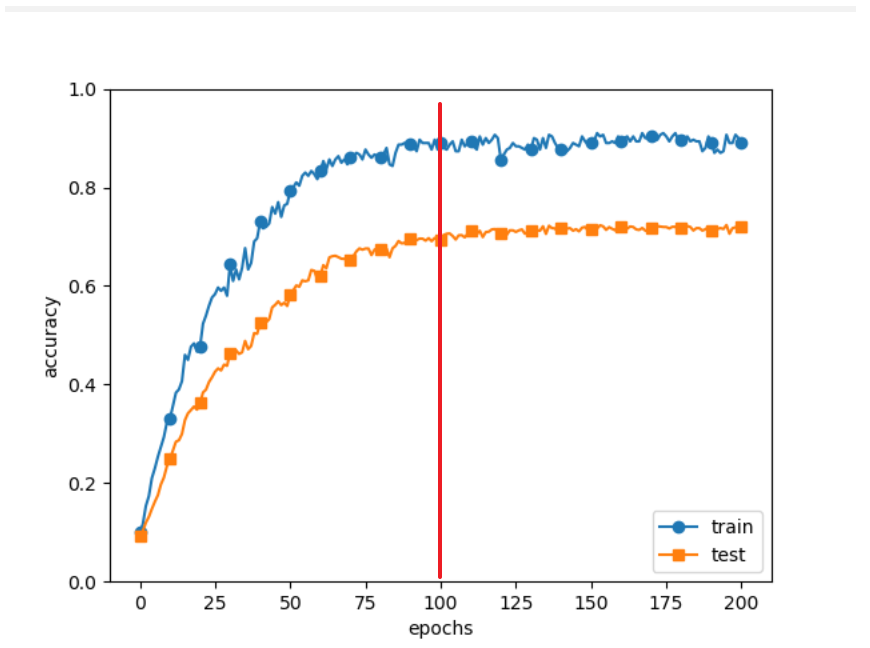

## 与学习相关的技巧

### 参数的更新

> 神经网络的学习的目的是找到使损失函数的值尽可能小的参数。

事实： 神经网络的最优化问题非常难。这是因为参数空间非常复杂，无法轻易找到 最优解。

随机梯度下降法（stochastic gradient descent）， 简称SGD。SGD是一个简单的方法，不过比起胡乱地搜索参数空间，也算是“聪 明”的方法。

#### SGD

$$ \boldsymbol{W} \leftarrow \boldsymbol{W}-\eta \frac{\partial L}{\partial \boldsymbol{W}} $$

式中，需要更新的权重参数记为W，把损失函数关于W的梯度记为$\frac{\partial L}{\partial W} $ 。 η表示学习率，实际上会取0.01或0.001这些事先决定好的值。

#### SGD的缺点

思考这个公式 $$ f(x, y)=\frac{1}{20} x^{2}+y^{2} $$ 直观上感觉，也就是梯度特征是：y轴方向上大，x轴方向上小。因为x前面有个系数1/20.


上图是Z轴的俯视图。

从(x, y) = (−7.0, 2.0)处 （初始值）开始搜索，结果如图6-3所示。


**SGD低效的根本原因是，梯度的方向并没有指向最小值的方向。**

#### Momentum

Momentum是“动量”的意思，和物理有关。 $$ \begin{array}{c} \boldsymbol{v} \leftarrow \alpha \boldsymbol{v}-\eta \frac{\partial
L}{\partial \boldsymbol{W}} \tag{6.3} \end{array} $$ $$ \begin{array} \boldsymbol{W} \leftarrow
\boldsymbol{W}+\boldsymbol{v} \end{array} \tag{6.4} $$ W表示要更新的权重参数， $\frac{\partial L}{\partial W}$
表示损失函数关于W的梯度，η表示学习率。这里新出现了一个变量v，对应物理上的速度。

式（6.3）表示了物体在梯度方向上受力，在这个力的作用下，物体的速度增 加这一物理法则.

式（6.3）中有αv这一项。在物体不受任何力时，该项承担使物体逐渐减 速的任务（α设定为0.9之类的值）,对应物理上的地面摩擦或空气阻力.

代码描述

```python
class Momentum:
    """Momentum SGD"""

    def __init__(self, lr=0.01, momentum=0.9):
        self.lr = lr
        self.momentum = momentum  # α
        self.v = None

    def update(self, params, grads):
        if self.v is None:
            self.v = {}
            for key, val in params.items():
                self.v[key] = np.zeros_like(val)

        for key in params.keys():
            self.v[key] = self.momentum * self.v[key] - self.lr * grads[key]
            params[key] += self.v[key]
```

新路径就像小球在碗中滚动一样。和SGD相比，“之”字形的“程度”减轻了。因为虽然x轴方向上受到的力非常小，但 是一直在同一方向上受力，所以朝同一个方向会有一定的加速。反过来，虽
然y轴方向上受到的力很大，但是因为交互地受到正方向和反方向的力，它们会互相抵消，所以y轴方向上的速度不稳定。因此，和SGD时的情形相比， 可以更快地朝x轴方向靠近，减弱“之”字形的变动程度.


#### AdaGrad

在神经网络的学习中，学习率（数学式中记为η）的值很重要。学习率过小， 会导致学习花费过多时间；反过来，学习率过大，则会导致学习发散而不能 正确进行。

有一种被称为学习率衰减（learning rate decay）的方法，即随着学习的进行，使学习率逐渐减小。实际上，一开始“多” 学，然后逐渐“少”学的方法，在神经网络的学习中经常被使用。

AdaGrad会为参数的每个元素适当地调整学习率，与此同时进行学习。 $$ \begin{array}{l} \boldsymbol{h} \leftarrow \boldsymbol{h}+\frac{\partial
L}{\partial \boldsymbol{W}} \odot \frac{\partial L}{\partial \boldsymbol{W}} \\ \boldsymbol{W} \leftarrow
\boldsymbol{W}-\eta \frac{1}{\sqrt{\boldsymbol{h}}} \frac{\partial L}{\partial \boldsymbol{W}} \end{array} $$ $\odot$
表示矩阵元素的乘法。W表示要更新的权重参数， $\frac{\partial L}{\partial W}$ 表示损失函数关于W的梯度，η表示学习率。这里新出现了变量h，它保存了以前的所有梯度值的平方和。

在更新参数时，通过乘以$\frac{1}{\sqrt{h} } $ ，就可以调整学习的尺度。h越大，反映在$\frac{1}{\sqrt{h} } $就越小。也就是

> 可以按参数的元素进行学习率衰减，使变动大的参数的学习率逐渐减小。

> AdaGrad会记录过去所有梯度的平方和。因此，学习越深入，更新
> 的幅度就越小。实际上，如果无止境地学习，更新量就会变为 0，
> 完全不再更新。为了改善这个问题，可以使用 RMSProp方法。

代码描述

```python
class AdaGrad:
    """AdaGrad"""

    def __init__(self, lr=0.01):
        self.lr = lr
        self.h = None

    def update(self, params, grads):
        if self.h is None:
            self.h = {}
            for key, val in params.items():
                self.h[key] = np.zeros_like(val)

        for key in params.keys():
            self.h[key] += grads[key] * grads[key]
            params[key] -= self.lr * grads[key] / (np.sqrt(self.h[key]) + 1e-7)
```

注意这里的`np.sqrt(self.h[key]) + 1e-7)`，防止当 self.h[key]中有0时，将0用作除数的情况。


分析：

由于y轴方 向上的梯度较大，因此刚开始变动较大，但是后面会根据这个较大的变动按 比例进行调整，减小更新的步伐。因此，y轴方向上的更新程度被减弱， “之” 字形的变动程度有所衰减。

#### Adam

Momentum参照小球在碗中滚动的物理规则进行移动，AdaGrad为参 数的每个元素适当地调整更新步伐.

Adam是2015年提出的新方法。它的理论有些复杂，直观地讲，就是融 合了Momentum和AdaGrad的方法.

> 通过组合前面两个方法的优点，有望
> 实现参数空间的高效搜索。此外，进行超参数的“偏置校正”也是Adam的特征。

具体实现请参考原论文和该项目代码src.common.optimizer.Adam。


#### 使用哪种更新方法

并不存在能在所有问题中都表现良好 的方法。这4种方法各有各的特点，都有各自擅长解决的问题和不擅长解决 的问题.

#### 基于MNIST数据集的更新方法的比较


与SGD相比，其他3种方法学习得更快，而且 速度基本相同，仔细看的话，AdaGrad的学习进行得稍微快一点。

### 权重的初始值

#### 可以将权重初始值设为0吗

结论：将权重初始值设为 0的话，将无法正确进行学习。

理由：严格地说，不能将权重初始值设成一样的值。在误差反向传播法中，所有的权重值都会进行相同的更新。比如，在2层神经网络中，假设第1层和第2层的权重为0。这样一来，正向传播时，因为输入层的权重为0，所以第2层的神经元全部会被传递相同的值。第2层的神经元中全部输入相同的值，这意味着反向传播
时第2层的权重全部都会进行相同的更新。

#### 隐藏层的激活值的分布

这里要做的实验是，向一个5层神经网络（激活函数使用 sigmoid函数）传入随机生成的输入数据，用直方图绘制各层激活值的数据分布。这个实验参考了斯坦福大学的课程CS231n。

```python
# 1000 x 100
input_data = np.random.randn(1000, 100)  # 1000个数据
node_num = 100  # 各隐藏层的节点（神经元）数
hidden_layer_size = 5  # 隐藏层有5层
activations = {}  # 激活值的结果保存在这里

x = input_data

for i in range(hidden_layer_size):
    # 上次激活的输出就是这次的输入x
    if i != 0:
        x = activations[i - 1]

    w = np.random.randn(node_num, node_num) * 1
    a = np.dot(x, w)
    z = sigmoid(a)

    activations[i] = z

# 绘制直方图
for i, a in activations.items():
    # 绘制子图形，这里是5个
    plt.subplot(1, len(activations), i + 1)
    plt.title(str(i + 1) + "-layer")

    # 由于i=0时已经绘制了左侧y轴刻度(locs+ticks),i>0不需要再次绘制，没必要
    if i != 0: plt.yticks([], [])

    # 缩小x刻度标签避免重叠
    plt.tick_params(axis='x', labelsize=6)
    # 1.1是为了将1.0包含进来
    plt.xticks(np.arange(0, 1.1, step=0.2))

    # x, bins, range
    # x的值为a.flatten(),小长方形条的数量，x的取值范围为(0,1)
    plt.hist(a.flatten(), 30, range=(0, 1))
plt.show()
```


随着输出不断地靠近0（或者靠近1），它的导数的值逐渐接近0。回忆一下sigmoid的偏导： $$ \frac{\partial y}{\partial x} =y(1-y)
$$ 因此，偏向0和1的数据分布会造成反向传播中梯度的值不断变小，最后消失。这个问题称为梯度消失（gradient vanishing）。

> 问题：为何x=0或1，梯度消失时，对应上图的直方条最高？有什么含义？

---

下面，将权重的标准差设为0.01，进行相同的实验。


这次呈集中在0.5附近的分布。不像刚才的例子那样偏向0和1，所以不会发生梯度消失的问题。但是，激活值的分布有所偏向，说明在表现力 上会有很大问题。

> 比如，如果100个神经元都输出几乎相
> 同的值，那么也可以由1个神经元来表达基本相同的事情。

Xavier的论文中，为了使各层的激活值呈现出具有相同广度的分布，推导了合适的权重尺度。推导出的结论是，如果前一层的节点数为n，则初始 值使用标准差为$\frac{1}{\sqrt{n} } $的分布


```python
w = np.random.randn(node_num, node_num) / np.sqrt(node_num)
```


> 后面的层的分布呈稍微歪斜的形状。如果用tanh
> 函数（双曲线函数）代替 sigmoid函数，这个稍微歪斜的问题就能得
> 到改善。实际上，使用 tanh函数后，会呈漂亮的吊钟型分布。tanh
> 函数和sigmoid函数同是S型曲线函数，但tanh函数是关于原点(0, 0)
> 对称的S型曲线，而 sigmoid函数是关于(x, y)=(0, 0.5)对称的S型曲
> 线。众所周知，**用作激活函数的函数最好具有关于原点对称的性质**。

> 事实上，个人测试结果表示tanh函数并没有表现出漂亮的吊钟型分布。

#### ReLU的权重初始值

Xavier 初始值是以激活函数是线性函数为前提而推导出来的。因为 sigmoid函数和 tanh函数左右对称，且中央附近可以视作线性函数，所以适 合使用Xavier初始值。

但当激活函数使用ReLU时，一般推荐使用ReLU专 用的初始值，也就是Kaiming He等人推荐的初始值，也称为“He初始值”
[10]。 当前一层的节点数为n 时，He 初始值使用标准差为$\sqrt{\frac{2}{n} } $的高斯分布。当 Xavier初始值是 $\sqrt{\frac{1}{n} }$ 时，（直观上）可以解释为，因为ReLU的负值区域的值
为0，为了使它更有广度，所以需要2倍的系数.

实验比较：下面均使用ReLU作为激活函数。

> **权重初始值为标准差是 0.01 的高斯分布时**


> 权重初始值为 Xavier 初始值时


> 权重初始值为 He 初始值时


观察实验结果可知，当“std = 0.01”时，各层的激活值非常小 A。神经网 络上传递的是非常小的值，说明逆向传播时权重的梯度也同样很小。这是很 严重的问题，实际上学习基本上没有进展。

初始值为Xavier初始值时，随着层的加深， 偏向一点点变大。实际上，层加深后，激活值的偏向变大，学习时会出现梯 度消失的问题。而当初始值为He初始值时，各层中分布的广度相同。由于
即便层加深，数据的广度也能保持不变，因此逆向传播时，也会传递合适的值。

总结一下，**当激活函数使用ReLU时，权重初始值使用He初始值，当**
**激活函数为 sigmoid或 tanh等S型曲线函数时，初始值使用Xavier初始值。**
**这是目前的最佳实践**。

#### 基于MNIST数据集的权重初始值的比较


基于std = 0.01、Xavier初始值、He初始值进行实验（源代码在 ch06/weight_init_compare.py中）。

综上，在神经网络的学习中，权重初始值非常重要。

### Batch Normalization

#### Batch Normalization 的算法

Batch Norm（2015）有以下优点。

- 可以使学习快速进行（可以增大学习率）。
- 不那么依赖初始值（对于初始值不用那么神经质）。
- 抑制过拟合（降低Dropout等的必要性）

Batch Norm的思路是调整各层的激活值分布使其拥有适当 的广度。为此，要向神经网络中插入对数据分布进行正规化的层，即Batch Normalization层（简称Batch Norm层）

```
Affine -> Batch Norm -> ReLU
```

$$ \begin{aligned} \mu_{B} & \leftarrow \frac{1}{m} \sum_{i=1}^{m} x_{i} \\ \sigma_{B}^{2} & \leftarrow \frac{1}{m}
\sum_{i=1}^{m}\left(x_{i}-\mu_{B}\right)^{2} \\ \hat{x}_{i} & \leftarrow \frac{x_{i}-\mu_{B}}{\sqrt{\sigma_
{B}^{2}+\varepsilon}} \end{aligned} \tag{6.7} $$

这里对 mini-batch 的 m 个输入数据的集合 B = {x1, x2, . . . , xm} 求均值 $\mu_{B}$和方差 $\sigma_{B}^{2}$。然后，对输入数据进行均值为0、方差为1（合适的分布）的
正规化。式（6.7）中的ε是一个微小值（比如，10e-7等），它是为了防止出现 除以0的情况。

式（6.7）所做的是将mini-batch的输入数据{x1, x2, . . . , xm}变换为均值为0、方差为1的数据 ，非常简单。通过将这个处理插入到 激活函数的前面（或者后面） A，可以减小数据分布的偏向。

接着，Batch Norm层会对正规化后的数据进行缩放和平移的变换，用 数学式可以如下表示。 $$ y_{i} \leftarrow \gamma \hat{x}_{i}+\beta $$ 这里，γ和β是参数。一开始γ = 1，β = 0。


> 参考： Frederik Kratzert 的博客Understanding the backward
> pass through Batch Normalization Layer

#### Batch Normalization的评估


> src/ch06/batch_norm_test.py

分析：

- 几乎所有的情况下都是使用Batch Norm时学习进行得更快。
- 在不使用Batch Norm的情况下，如果不赋予一 个尺度好的初始值，学习将完全无法进行（水平线）。

通过使用Batch Norm，可以推动学习的进行。并且，对权重初 始值变得健壮（“对初始值健壮”表示不那么依赖初始值）。

### 正则化

过拟合指的是只能拟合训练数据，但不能很好地拟合不包含在训练数据中的其他数据的状态。

> 机器学习的目标是提高泛化能力。

#### 过拟合

发生过拟合的原因，主要有以下两个。

- 模型拥有大量参数、表现力强。
- 训练数据少

我们故意满足这两个条件，制造过拟合现象。为此，从 MNIST 数据集原本的60000个训练数据中只选定300个，并且，为了增加网络的复杂度，使用7层网络（每层有100个神经元，激活函数为ReLU）。

> 对应文件在 ch06/overfit_weight_decay.py


过了 100 个 epoch 左右后，用训练数据测量到的识别精度几乎到了顶峰。但是，对于测试数据，离峰值识别精度还有较大的差距。如此大 的识别精度差距，是只拟合了训练数据的结果。

#### 权值衰减

该方法通过 在学习的过程中对大的权重进行惩罚，来抑制过拟合。

神经网络的学习目的是减小损失函数的值。例如为损失函数加上权重的平方范数（L2范数）。这样一来，就可以抑制权重变大。 用符号表示的话，如果将权重记为W，L2范数的权值衰减就是$\frac{1}{2} \lambda W^2$
，然后将$\frac{1}{2} \lambda W^2$ 加到损失函数上。

> 这里，λ是控制正则化强度的超参数。λ
> 设置得越大，对大的权重施加的惩罚就越重。

对于所有权重，权值衰减方法都会为损失函数加上$\frac{1}{2} \lambda W^2$ 。因此，在求权重梯度的计算中，要为之前的误差反向传播法的结果加上正则化项的导数λW。

> L2范数相当于各个元素的平方和。用数学式表示的话，假设有权重
> W = (w1, w2, . . . , wn)，则 L2 范数可用$
> \sqrt{w_{1}^{2}+w_{2}^{2}+\cdots+w_{n}^{2}}
> $ 计算
> 出来。除了L2范数，还有L1范数、L∞范数等。L1范数是各个元
> 素的绝对值之和，相当于|w1| + |w2| + . . . + |wn|。L∞范数也称为
> Max范数，相当于各个元素的绝对值中最大的那一个。

对于刚刚进行的实验，应用λ = 0.1的权值衰减



虽然训练数据的识别精度和测试数据的识别精度之间有 差距，但是与没有使用权值衰减的结果相比，差距变小了。说明过拟合受到了抑制。此外，还要注意，训练数据的识别精度没有达到100%。

#### Dropout

如果网络的模型变得很复杂，只用权值衰减就难以应对了。在这种情 况下，我们经常会使用Dropout [14]方法。

dropout是一种在学习的过程中随机删除神经元的方法。训练时，随机选出隐藏层的神经元，然后将其删除。被删除的神经元不再进行信号的传递。训练时，每传递一次数据，就会随机选择要删除的神经元。

然后，测试时，虽然会传递所有的神经元信号，但是对于各个神经元的输出， 要乘上训练时的删除比例后再输出。

实现dropout

```python
class Dropout:
    """
    http://arxiv.org/abs/1207.0580
    """

    def __init__(self, dropout_ratio=0.5):
        self.dropout_ratio = dropout_ratio
        self.mask = None

    def forward(self, x, train_flg=True):
        if train_flg:
            self.mask = np.random.rand(*x.shape) > self.dropout_ratio
            return x * self.mask
        else:
            return x * (1.0 - self.dropout_ratio)

    def backward(self, dout):
        return dout * self.mask
```

每次正向传播时，self.mask中都会以 False的形式保 存要删除的神经元。self.mask会随机生成和 x形状相同的数组，并将值比 dropout_ratio大的元素设为 True。

反向传播时的行为和ReLU相同。

正向传播时传递了信号的神经元，反向传播时按原样传递信号；正向传播时没有传递信号的神经元，反向传播时信号将停在那里。

> dropout false


> dropout true; dropout_ratio = 0.2


> dropout true; dropout_ratio = 0.15


通过使用Dropout，训练数据和测试数据的识别精度的差距变小了。并且，训练数据也没有到达100%的识别精度。像这样，通过使用 Dropout，即便是表现力强的网络，也可以抑制过拟合。

> 训练数据和测试数据曲线拟合度越高，越接近，抑制过拟合的效果就越好。

### 超参数的验证

神经网络中，除了权重和偏置等参数，超参数（hyper-parameter）也经常出现。这里所说的超参数是指，比如各层的神经元数量、batch大小、参数更新时的学习率或权值衰减等。

#### 验证数据

> 不能用测试数据评估超参数的性能。
>
> 因为如果使用测试数据调整超参数，超参数的值会对测试数据发生过拟合。

调整超参数时，必须使用超参数专用的确认数据。用于调整超参 数的数据，一般称为验证数据（validation data）。

训练数据用于参数（权重和偏置）的学习，验证数据用于超参数的性 能评估。为了确认泛化能力，要在最后使用（比较理想的是只用一次） 测试数据。

举例：对于MNIST数据集，获得验证数据的最简单的方法就是从训练数据中事先分割20%作为验证数据。

#### 超参数的最优化

在超参数的最优化中，减少学习的epoch，缩短一次评估所需的时间 是一个不错的办法。

- 步骤0 设定超参数的范围。
- 步骤1 从设定的超参数范围中随机采样。
- 步骤2 使用步骤1中采样到的超参数的值进行学习，通过验证数据评估识别精 度（但是要将epoch设置得很小）。
- 步骤3 重复步骤1和步骤2（100次等），根据它们的识别精度的结果，缩小超参 数的范围。

> 在超参数的最优化中，如果需要更精炼的方法，可以使用贝叶斯最优
> 化（Bayesian optimization）

如前所述，通过从 0.001（10 −3）到 1000（10 3）这样的对数尺度的范围 中随机采样进行超参数的验证。这在Python中可以写成 10 ** np.random. uniform(-3, 3)。

进行超参数最优化的源代码在 ch06/hyperparameter_
optimization.py。

```bash
=========== Hyper-Parameter Optimization Result ===========
Best-1(val acc:0.81) | lr:0.008747947566201272, weight decay:5.3985884517836476e-05
Best-2(val acc:0.76) | lr:0.008311517802563213, weight decay:1.2789107520402049e-05
Best-3(val acc:0.73) | lr:0.0058943042145502686, weight decay:1.2284427789197235e-05
Best-4(val acc:0.73) | lr:0.007424269208009727, weight decay:4.4892425255837405e-06
Best-5(val acc:0.72) | lr:0.0064130752402277915, weight decay:4.014924427334361e-07
......
```

观察可以使学习顺利进行的超参 数的范围，从而缩小值的范围。例如上面的是：

> lr: 0.005-0.01 weight decay: $10^-8$ ~ $10^-6$

### 小结

- 参数的更新方法， SGD 、Momentum、AdaGrad、 Adam等方法。
- 作为权重初始值，Xavier初始值、He初始值等比较有效。
- 通过使用Batch Normalization，可以加速学习，并且对初始值变得 健壮。
- 抑制过拟合的正则化技术有权值衰减、Dropout等。
- 逐渐缩小“好值”存在的范围是搜索超参数的一个有效方法。