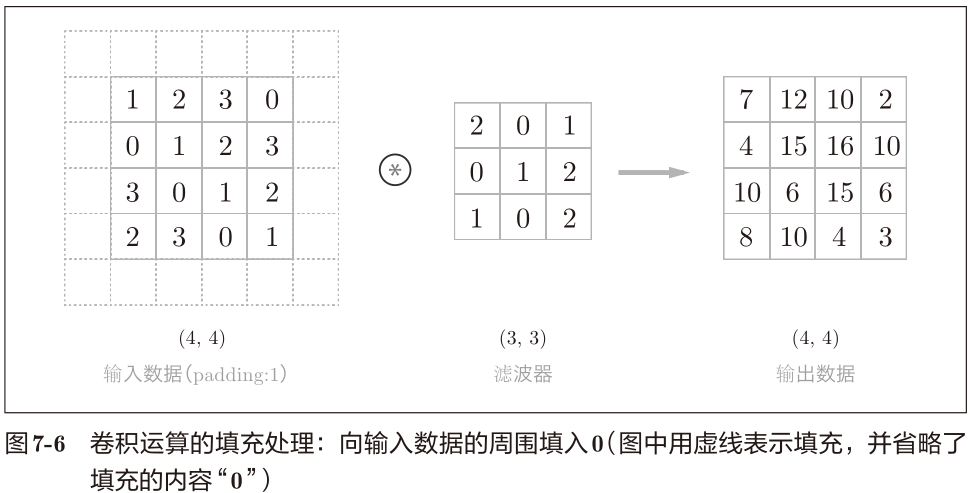
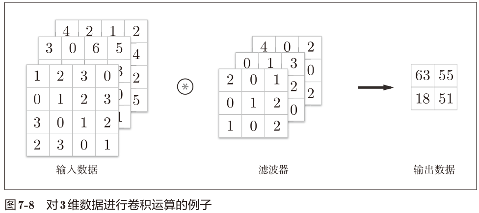

## 卷积神经网络

CNN中新出现了卷积层（Convolution层）和池化层（Pooling层）。

之前介绍的神经网络中，相邻层的所有神经元之间都有连接，这称为全
连接（fully-connected）。另外，我们用Affine层实现了全连接层。


需要注意的是，在图 7-2 的 CNN 中，靠近输出的层中使用了之前
的“Affi ne - ReLU”组合。此外，最后的输出层中使用了之前的“Affi ne -
Softmax”组合。

### 卷积层

#### 全连接层存在的问题

全连接层存在什么问题呢？那就是数据的形状被“忽视”了。

实际上，前面提到的使用
了 MNIST 数据集的例子中，输入图像就是 1 通道、高 28 像素、长 28 像素
的（1, 28, 28）形状，但却被排成1列，以784个数据的形式输入到最开始的
Affine层。

比如，空间上邻近的像素为相似的值、RBG的各个通道之间分别有密切的关联性、相距较远的像素之间没有什么关联等，3维形状中可能隐藏有值得提取的本质模式。但是，因为全连接层会忽视形状，将全部的输入数据作为相同的神经元
（同一维度的神经元）处理，所以无法利用与形状相关的信息。

卷积层的输入数据称为输入特征图（input feature map），输出数据称为输出特征图（output feature map）。

> 也就是卷积层能够保留输入的形状信息，空间信息。

#### 卷积运算

卷积层进行的处理就是卷积运算。卷积运算相当于图像处理中的“滤波
器运算。


在本例中，输入大小是
(4, 4)，滤波器大小是(3, 3)，输出大小是(2, 2)。

如图7-4所示，将各个位置上滤波器的元素和输入的对应元素相乘，然后再求和（有时将这个计算称为乘积
累加运算）。然后，将这个结果保存到输出的对应位置。


加上偏置


#### 填充

在图7-6的例子中，对大小为(4, 4)的输入数据应用了幅度为1的填充。“幅
度为1的填充”是指用幅度为1像素的0填充周围。

通过填充，大小为(4, 4)的输入数据变成了(6, 6)的形状。
然后，应用大小为(3, 3)的滤波器，生成了大小为(4, 4)的输出数据。



> 使用填充主要是为了调整输出的大小。比如，对大小为(4, 4)的输入
> 数据应用(3, 3)的滤波器时，输出大小变为(2, 2)，相当于输出大小
> 比输入大小缩小了2个元素。这在反复进行多次卷积运算的深度网
> 络中会成为问题。因为如果每次进行卷积运算都会缩小
> 空间，那么在某个时刻输出大小就有可能变为1，导致无法再应用
> 卷积运算。为了避免出现这样的情况，就要使用填充。在刚才的例
> 子中，将填充的幅度设为1，那么相对于输入大小(4, 4)，输出大小
> 也保持为原来的(4, 4)。因此，卷积运算就可以在保持空间大小不变
> 的情况下将数据传给下一层。

#### 步幅

应用滤波器的位置间隔称为步幅（stride）。之前的例子中步幅都是1，如
果将步幅设为2，则如图7-7所示，应用滤波器的窗口的间隔变为2个元素。


综上，增大步幅后，输出大小会变小。而增大填充后，输出大小会变大。

这里，假设输入大小为(H, W)，滤波器大小为(FH, FW)，输出大小为
(OH, OW)，填充为P，步幅为S。此时，输出大小可通过式(7.1)进行计算。
$$
\begin{aligned}
O H &=\frac{H+2 P-F H}{S}+1 \\
O W &=\frac{W+2 P-F W}{S}+1
\end{aligned}\tag{7.1}
$$
${H+2 P-F H}$可以认为是剩下的可移动的总距离，除以S就能得出一共还能走几步。加上之前出发点的第一步。那么结果就是上面的式子了。

输出大小无法除尽时（结果是小数时），需要采取报错等对策。根据深度学习的框架的不同，当值无法除尽时，有时会向最接近的整数四舍五入，不进行报错而继续运行。

#### 3维数据的卷积运算

图7-8是卷积运算的例子，图7-9是计算顺序。这里以3通道的数据为例，
展示了卷积运算的结果。



通道方向上有多个特征图时，会按通道
进行输入数据和滤波器的卷积运算，并将结果相加，从而得到输出。


需要注意的是，在3维数据的卷积运算中，**输入数据和滤波器的通道数要设为相同的值**。在这个例子中，输入数据和滤波器的通道数一致，均为3。

#### 结合方块思考

把3维数据表示为多维数组
时，书写顺序为（channel, height, width）。


多个过滤器的话


作为4维数据，滤波器的权重数据要按(output_channel, input_
channel, height, width) 的顺序书写。比如，通道数为 3、大小为 5 × 5 的滤
波器有20个时，可以写成(20, 3, 5, 5)。

考虑偏置。


#### 批处理

我们希望卷积运算也同样对应批处理。为此，需要将在各层间传递的数
据保存为4维数据。具体地讲，就是按(batch_num, channel, height, width)
的顺序保存数据。


### 池化层

池化是缩小高、长方向上的空间的运算。如图7-14所示，进行将
2 × 2的区域集约成1个元素的处理，缩小空间大小。


“Max
池化”是获取最大值的运算，“2 × 2”表示目标区域的大小。如图所示，从
2 × 2的区域中取出最大的元素。此外，这个例子将步幅设为了2，所以
2 × 2的窗口的移动间隔为2个元素。另外，一般来说，池化的窗口大小会
和步幅设定成相同的值。比如，3 × 3的窗口的步幅会设为3。

> 除了Max池化之外，还有Average池化，或许还有Min池化。

池化层的特征

- 没有要学习的参数
- 通道数不发生变化

- 对微小的位置变化具有鲁棒性（健壮）。

### 卷积层和池化层的实现

#### 4维数组

4维数据，比如数据的形状是(10, 1, 28, 28)，则它对应10个高为28、长为28、通道为1的数
据。

```python
>>> x = np.random.rand(10, 1, 28, 28) # 随机生成数据
>>> x.shape
(10, 1, 28, 28)
```

#### 基于im2col的展开

im2col是一个函数，将输入数据展开以适合滤波器（权重）。

如图7-18所示，
对于输入数据，将应用滤波器的区域（3维方块）横向展开为1~~列~~。im2col会
在所有应用滤波器的地方进行这个展开处理。


> im2col这个名称是“image to column”的缩写，翻译过来就是“从
> 图像到矩阵”的意思。Caffe、Chainer 等深度学习框架中有名为
> im2col的函数，并且在卷积层的实现中，都使用了 im2col。

> 勘误：上述7-18中展开为1列，应该是展开为一行。

使用 im2col展开输入数据后，之后就只需将卷积层的滤波器（权重）纵
向展开为1列，并计算2个矩阵的乘积。

如图7-19所示，基于 im2col方式的输出结果是2维矩阵。因为CNN中
数据会保存为4维数组，所以要将2维输出数据转换为合适的形状（reshape)。以上就
是卷积层的实现流程。


#### 卷积层的实现

> im2col的实现内容在 common/util.py中.

```
im2col (input_data, filter_h, filter_w, stride=1, pad=0)
```

```python
import sys, os
sys.path.append(os.pardir)
from common.util import im2col

x1 = np.random.rand(1, 3, 7, 7)
col1 = im2col(x1, 5, 5, stride=1, pad=0)
print(col1.shape) # (9, 75)

x2 = np.random.rand(10, 3, 7, 7) # 10个数据
col2 = im2col(x2, 5, 5, stride=1, pad=0)
print(col2.shape) # (90, 75)
```

批大小为1时，im2col的结果是 (9, 75)。而第2
个例子中批大小为10，所以保存了10倍的数据，即 (90, 75).

初步实现

```python
class Convolution:
    def __init__(self, W, b, stride=1, pad=0):
        self.W = W
        self.b = b
        self.stride = stride
        self.pad = pad

    def forward(self, x):
        FN, C, FH, FW = self.W.shape
        N, C, H, W = x.shape
        out_h = int(1 + (H + 2 * self.pad - FH) / self.stride)
        out_w = int(1 + (W + 2 * self.pad - FW) / self.stride)
        
        col = im2col(x, FH, FW, self.stride, self.pad)
        col_W = self.W.reshape(FN, -1).T  # 滤波器的展开
        out = np.dot(col, col_W) + self.b
        out = out.reshape(N, out_h, out_w, -1).transpose(0, 3, 1, 2)
        
        return out
```

注意这行

```
col_W = self.W.reshape(FN, -1).T  # 滤波器的展开
```

通过在 reshape时指定为 -1，reshape函数会自
动计算 -1维度上的元素个数，以使多维数组的元素个数前后一致。**比如，**
**(10, 3, 5, 5)形状的数组的元素个数共有 750个，指定 reshape(10,-1)后，就**
**会转换成(10, 75)形状的数。也即是10行75列的数据**。理解这点非常重要。

forward的实现中，最后会将输出大小转换为合适的形状。转换时使用了
NumPy的 transpose函数。transpose会更改多维数组的轴的顺序。


接下来是卷积层的反向传播的实现，和Affine层的实现有很多共通的地方，就不再介绍。有一点需要注意，在进行卷积层的反向传播时，必须进行 im2col
的逆处理。这可以使用本书提供的 col2im函数。除了使用 col2im这一点，卷积层的反向传播和Affi ne层的实
现方式都一样。

#### 池化层的实现

池化在通道方向上是独立的，这一点和卷积层不同。具体地讲，池化的应用区域按通道单独展开。


代码描述

```python
class Pooling:
    def __init__(self, pool_h, pool_w, stride=1, pad=0):
        self.pool_h = pool_h
        self.pool_w = pool_w
        self.stride = stride
        self.pad = pad

    def forward(self, x):
        N, C, H, W = x.shape
        out_h = int(1 + (H - self.pool_h) / self.stride)
        out_w = int(1 + (W - self.pool_w) / self.stride)
        # 展开(1)
        col = im2col(x, self.pool_h, self.pool_w, self.stride, self.pad)
        col = col.reshape(-1, self.pool_h * self.pool_w)
        # 最大值(2)
        out = np.max(col, axis=1)
        # 转换(3)
        out = out.reshape(N, out_h, out_w, C).transpose(0, 3, 1, 2)
        return out
```

池化层的实现按下面3个阶段进行

1. 展开输入数据。
2. 求各行的最大值。
3. 转换为合适的输出大小

> np.max 可以指定
> axis参数，并在这个参数指定的各个轴方向上求最大值

池化层的 backward处理可以参考ReLU层的实现中使用的max的反向传播。池化层的实现在common/layer.py中.

### CNN的实现


> SimpleConvNet的初始化

参数

- input_dim―输入数据的维度：（通道，高，长）C H W
- conv_param―卷积层的超参数（字典）。字典的关键字如下：
  - filter_num―滤波器的数量 FN
  - filter_size―滤波器的大小 FS, （这个指高和宽一致？例如 3 X 3？）
  - stride―步幅
  - pad―填充
- hidden_size―隐藏层（全连接）的神经元数量
- output_size―输出层（全连接）的神经元数量
- weitght_int_std―初始化时权重的标准差

> 卷积层的超参数 conv_param。设想它会像 {'filter_num':30,'filter_size':5, 'pad':0, 'stride':1}这样，保存必要的超参数值。

代码实现：src/ch07/simple_convnet.py

学习的代码：src/ch07/train_convnet.py

> 使用前5000份数据快速测试，得出的正确率为 test acc:0.954。

### CNN的可视化

#### 第1层权重的可视化

我们对 MNIST 数据集进行了简单的 CNN 学习。当时，第 1 层的
卷积层的权重的形状是(30, 1, 5, 5)，即30个大小为5 × 5、通道为1的滤波
器。滤波器大小是5 × 5、通道数是1，意味着滤波器可以可视化为1通道的
灰度图像。


通过学
习，滤波器被更新成了有规律的滤波器，比如从白到黑渐变的滤波器、含有
块状区域（称为blob）的滤波器等。

#### 基于分层结构的信息提取

第1层的卷积层中提取了边
缘或斑块等“低级”信息，那么在堆叠了多层的CNN中，各层中又会提取什
么样的信息呢？根据深度学习的可视化相关的研究
[17][18]，随着层次加深，提
取的信息（正确地讲，是反映强烈的神经元）也越来越抽象。


### 具有代表性的CNN

一个是在1998年首次被提出的CNN元祖LeNet[20]，
另一个是在深度学习受到关注的2012年被提出的AlexNet。

#### LeNet

它有连续的卷积层和池化层（正确地讲，是只“抽选元素”的子采样层），最后经全连接层输出结果。


LeNet 中使用sigmoid 函数，而现在的 CNN中主要使用 ReLU 函数。
此外，原始的LeNet中使用子采样（subsampling）缩小中间数据的大小，而现在的CNN中Max池化是主流。

#### AlexNet


AlexNet叠有多个卷积层和池化层，最后经由全连接层输出结果。

- 激活函数使用ReLU。
- 使用进行局部正规化的LRN（Local Response Normalization）层。
- 使用Dropout。

### 小结

在图像处理领域，几乎毫无例外地都会使用CNN。

- CNN在此前的全连接层的网络中新增了卷积层和池化层。
- 使用 im2col函数可以简单、高效地实现卷积层和池化层。
- 通过CNN的可视化，可知随着层次变深，提取的信息愈加高级。
- LeNet和AlexNet是CNN的代表性网络。
- 在深度学习的发展中，大数据和GPU做出了很大的贡献