## 深度学习

深度学习是加深了层的深度神经网络。

### 加深网络

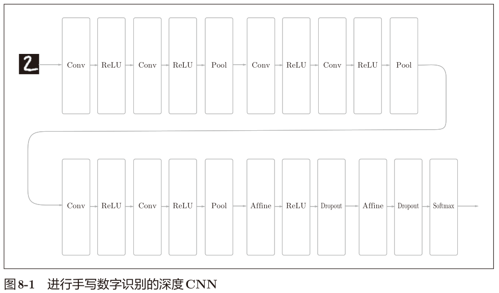

这个网络使用He初始值作为权重的初始值，使用Adam更新权重参数。
有如下特点。

- 基于3×3的小型滤波器的卷积层。
- 激活函数是ReLU。
- 全连接层的后面使用Dropout层。
- 基于Adam的最优化。
- 使用He初始值作为权重初始值。

这个网络的识别精度为99.38%。

>实现图8-1的网络的源代码在 ch08/deep_convnet.py中，训练用的代码在 ch08/train_deepnet.py中。虽然使用这些代码可以重现这里
>进行的学习，不过深度网络的学习需要花费较多的时间。

误判例子分析

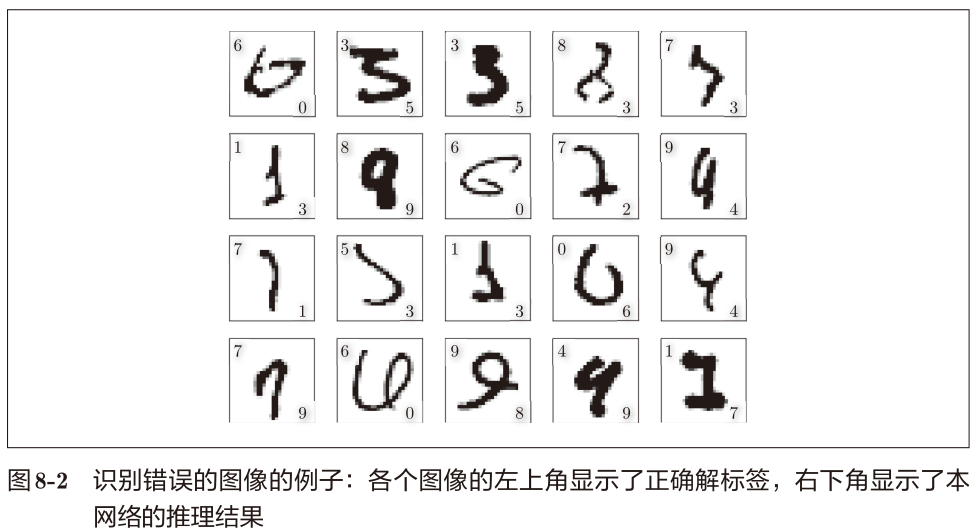

深度CNN尽管识别精度很高，但是对于某些图像，也犯了和人
类同样的“识别错误"。

#### 提高识别精度

在一个标题为“What is the class of this image ?”的网站
[32]上，以排行
榜的形式刊登了目前为止通过论文等渠道发表的针对各种数据集的方法的识
别精度（图8-3）

截止到2016年6月，对MNIST数据集的最高
识别精度是99.79%（错误识别率为0.21%）。

> TODO: update this statistics data

集成学习、学习率衰减、Data Augmentation（数据扩充）等都有
助于提高识别精度。

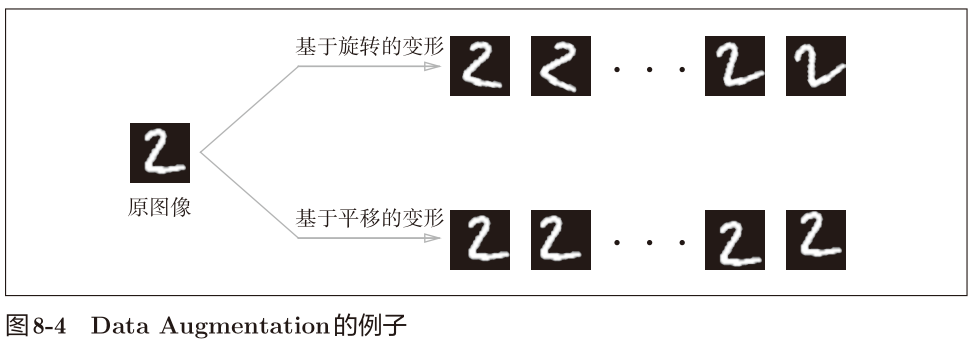

Data Augmentation还可以通过其他各种方法扩充图像，比如裁剪图像的 “crop处理”、将图像左右翻转的“flip处
理”
A 等。对于一般的图像，施加亮度等外观上的变化、放大缩小等尺度上
的变化也是有效的。不管怎样，通过Data Augmentation巧妙地增加训练图像，
就可以提高深度学习的识别精度。

#### 加深层的动机

**可以减少网络的参数量**。与没有加深层的网络相比，加深了层的网络可以
用更少的参数达到同等水平（或者更强）的表现力。

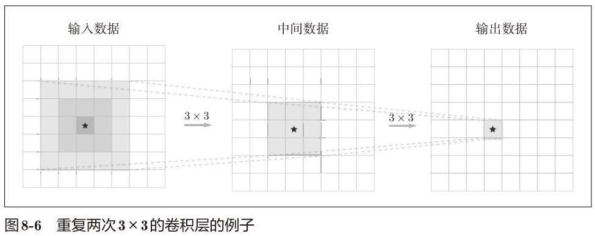

一次5 × 5的卷积运算的区域可以由两次3 × 3的卷积运算抵充。并且，
相对于前者的参数数量25（5 × 5），后者一共是18（2 × 3 × 3），通过叠加卷
积层，参数数量减少了。

通过加深层，**可以分层次地传递信息**，这一点也很重要。比如，因为提
取了边缘的层的下一层能够使用边缘的信息，所以应该能够高效地学习更加
高级的模式。

### 深度学习的小历史

ImageNet比赛

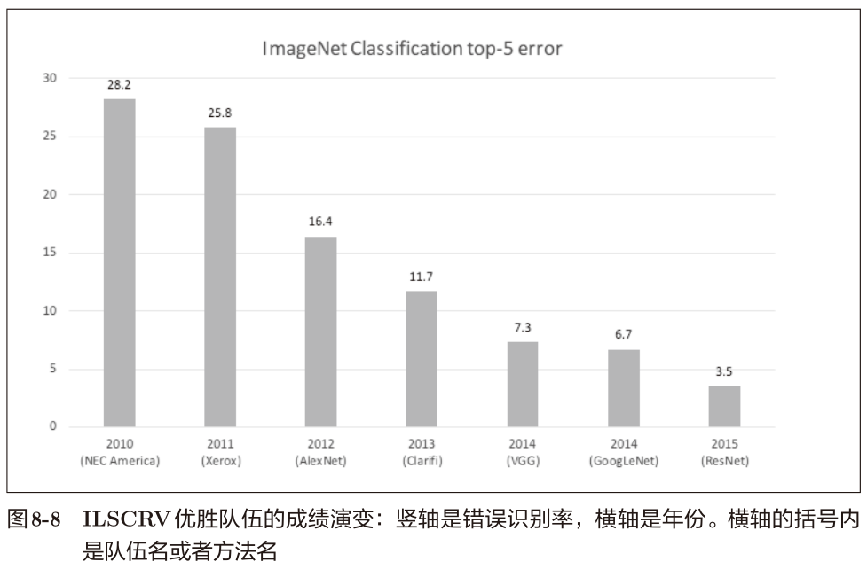

#### VGG

VGG 是由卷积层和池化层构成的基础的 CNN。不过，如图 8-9所示，
它的特点在于将有权重的层（卷积层或者全连接层）叠加至16层（或者19层），
具备了深度（根据层的深度，有时也称为“VGG16”或“VGG19”）。

VGG基于3×3的小型滤波器的卷积层的运算是连续进行的。如图8-9所示，重复进行“卷积层重叠2次到4次，再通过池化
层将大小减半”的处理，最后经由全连接层输出结果。

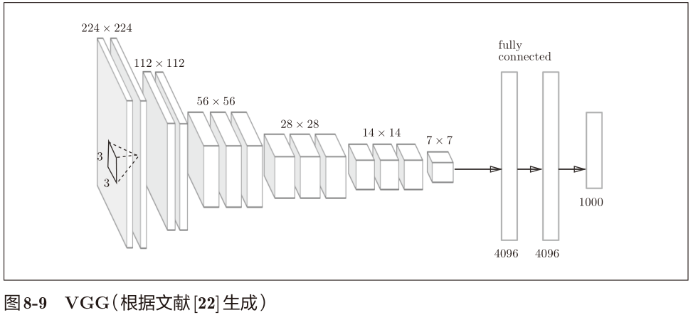

#### GoogLeNet

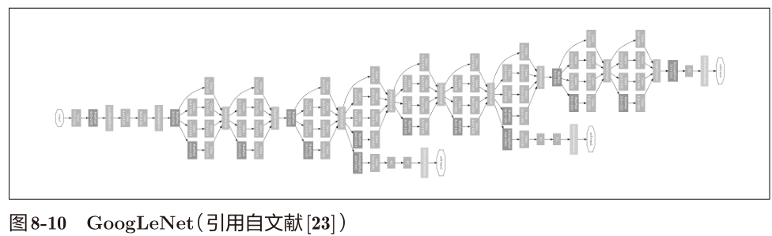

GoogLeNet在横向上有“宽度”，这称为“Inception结构”。

Inception结构使用了多个大小不同的滤波器（和池化），
最后再合并它们的结果。

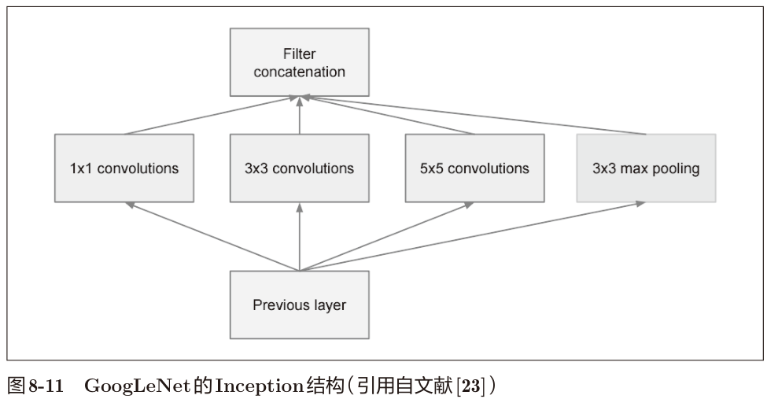

1 × 1的卷积运算通过在通道方向上减小大小，
有助于减少参数和实现高速化处理。

#### ResNet

快捷结构横跨（跳过）了输入数据的卷积层，将输入 x合
计到输出。

连续2层的卷积层中，将输入x跳着连接至2层后的输出。
这里的重点是，通过快捷结构，原来的2层卷积层的输出F(x)变成了F(x) + x。

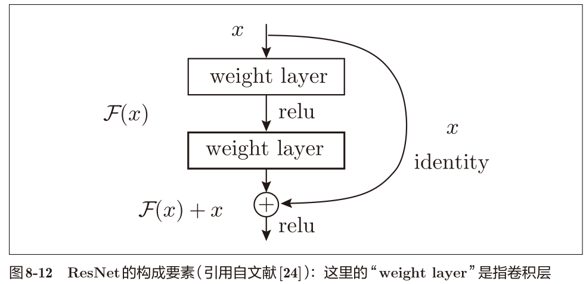

ResNet以前面介绍过的VGG网络为基础，引入快捷结构以加深层。

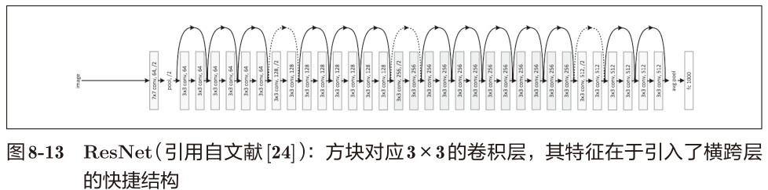

> 实践中经常会灵活应用使用ImageNet这个巨大的数据集学习到的权
> 重数据，这称为迁移学习，将学习完的权重（的一部分）复制到其他
> 神经网络，进行再学习（fine tuning）。比如，准备一个和VGG相同
> 结构的网络，把学习完的权重作为初始值，以新数据集为对象，进
> 行再学习。

### 深度学习的高速化

#### 基于GPU的高速化

GPU主要由NVIDIA和AMD两家公司提供。虽然两家的GPU都可以
用于通用的数值计算，但与深度学习比较“亲近”的是NVIDIA的GPU。

因为深度学习
的框架中使用了NVIDIA提供的CUDA这个面向GPU计算的综合开发环境。

#### 分布式学习

> 分布式学习的框架

#### 运算精度的位数缩减

深度学习并不那么需要数值精度的位数。这是神经网络的一个重要性质。这个性质是基于神经
网络的健壮性而产生的。

根据以往的实验结果，在深度学习中，即便是16位的半精度浮点数（half float），也可以顺利地进行学习。

NumPy中提供了16位的半精度浮点数类型（不过，只有16位类型的存储，运算本身不用16位进行），即便使用NumPy的半精度
浮点数，识别精度也不会下降。相关的论证请参考
ch08/half_float_network.py

### 深度学习的应用案例

#### 物体检测

物体检测是从图像中确定物体的位置，并进行分类的问题。

R-CNN：候选区域的提取和CNN特征的计算。

#### 图像分割

图像分割是指在像素水平上对图像进行分类。

有人提出了一个名为FCN（Fully Convolutional
Network）
[37]的方法。该方法通过一次 forward处理，对所有像素进行分类。

FCN的字面意思是 “全部由卷积层构成的网络”。相对于一般的CNN包
含全连接层，FCN将全连接层替换成发挥相同作用的卷积层。

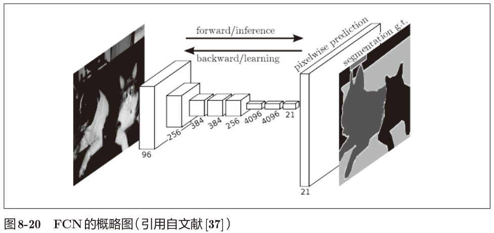

> 全连接层中，输出和全部的输入相连。使用卷积层也可以实现与此
> 结构完全相同的连接。比如，针对输入大小是 32×10×10（通道
> 数32、高10、长10）的数据的全连接层可以替换成滤波器大小为
> 32×10×10的卷积层。如果全连接层的输出节点数是100，那么在
> 卷积层准备100个32×10×10的滤波器就可以实现完全相同的处理。

#### 图像标题的生成

一个基于深度学习生成图像标题的代表性方法是被称为 NIC（Neural
Image Caption）的模型。如图8-22所示，NIC由深层的CNN和处理自然语
言的RNN（Recurrent Neural Network）构成。

我们将组合图像和自
然语言等多种信息进行的处理称为**多模态处理**。

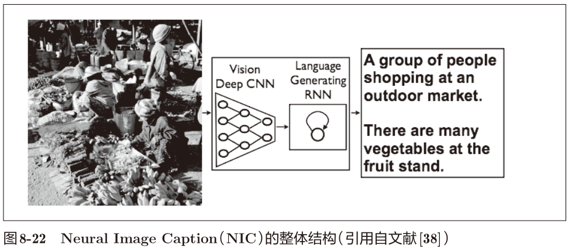

### 小结

- VGG、GoogLeNet、ResNet是几个著名的网络。
- 基于GPU、分布式学习、位数精度的缩减，可以实现深度学习的高速化。
- 深度学习可以用于物体识别、物体检测、
  图像分割。
- 深度学习的应用包括图像标题的生成、图像的生成、强化学习等。最近，在自动驾驶上的应用也备受期待。

