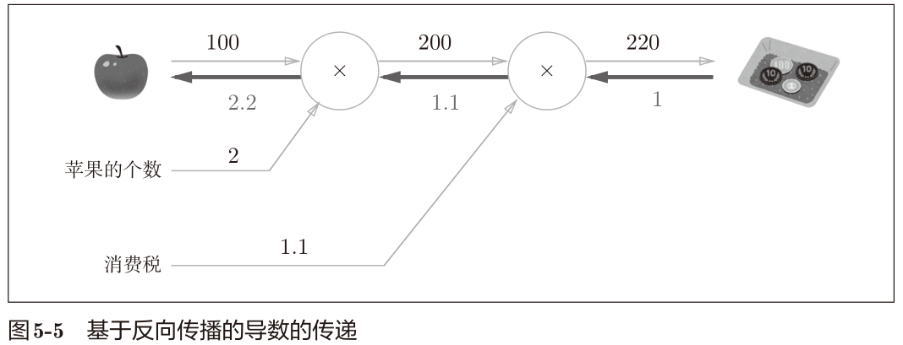
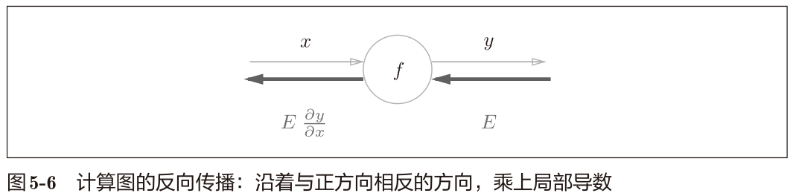
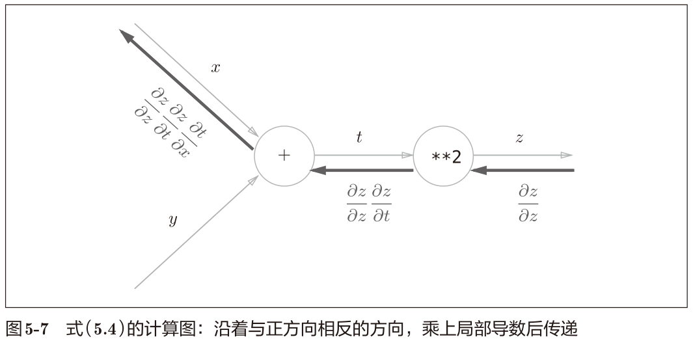
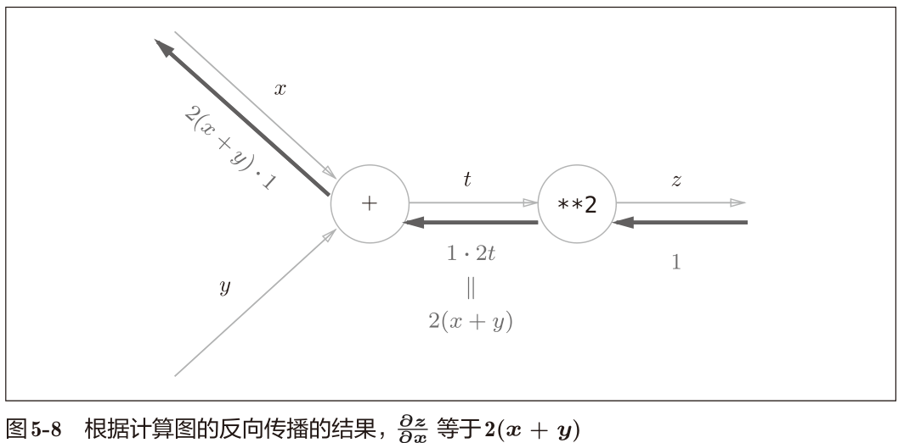
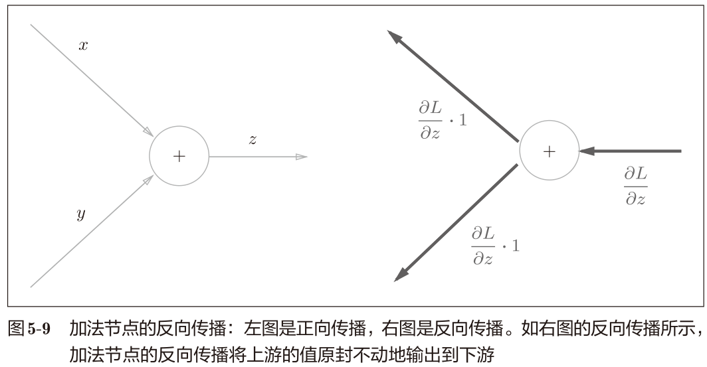
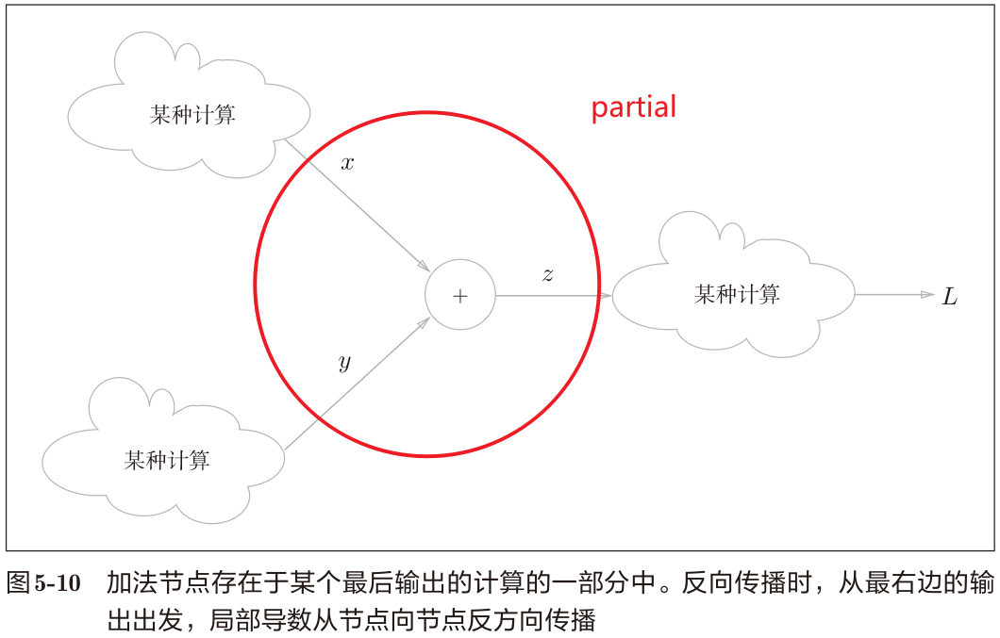
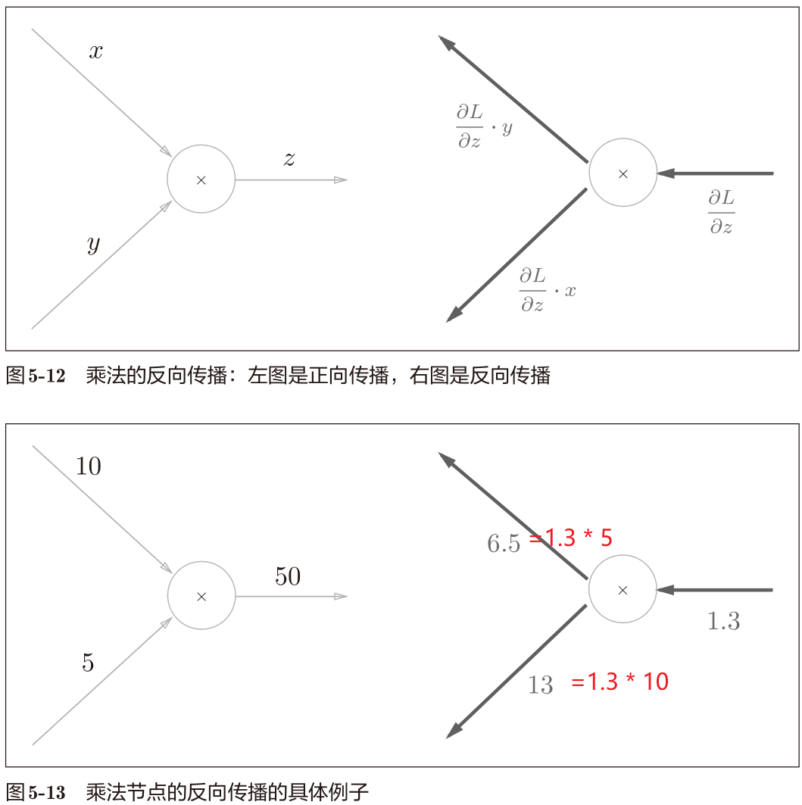
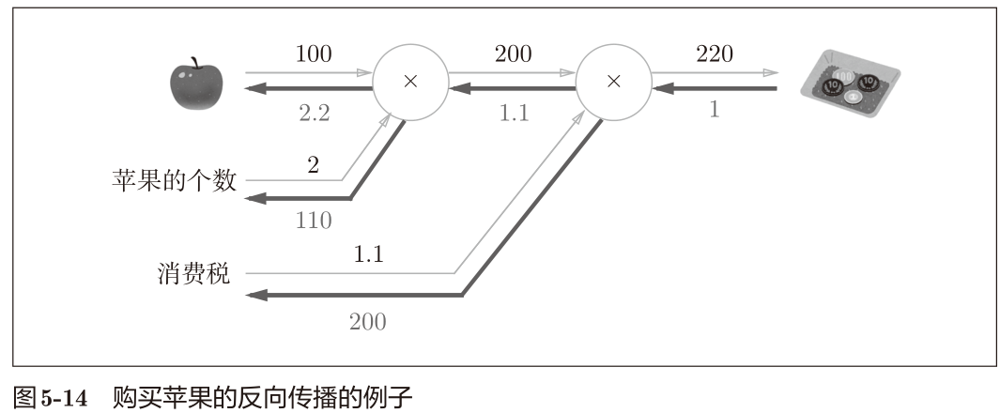
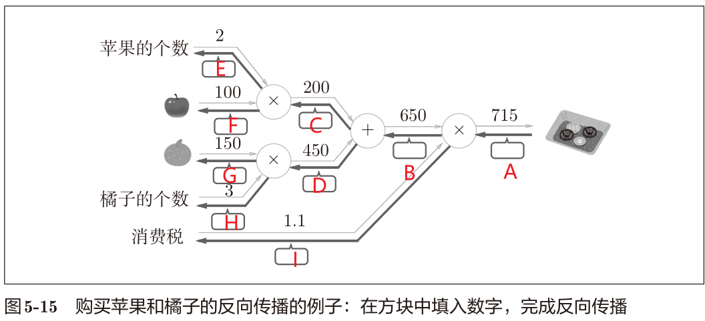

## 第5章 误差反向传播法

### 计算图
正确理解误差反向传播法，我个人认为有两种方法：
- 一种是基于数学式；
- 另一种是基于计算图（computational graph）。利于直观上的理解。

用计算图解题的情况下，需要按如下流程进行。
1. 构建计算图。
2. 在计算图上，从左向右进行计算

第2歩“从左向右进行计算”是正向传播（forward propagation）。正向传播是从计算图出发点到结束点的传播。
也有反向传播（backward propagation）。反向传播将在接下来的导数计算中发挥重要作用。

#### 计算图的优点
- 局部计算。通过局部计算使各个节点致力于简单的计算，简化问题。
- 通过反向传播高效计算导数。

#### 思考问题：苹果价格上涨对总体付费金额的影响
> 想知道苹果价格的上涨会在多大程度上影响最终的支付金额，即求“支付金额关于苹果的价格的导数”

$$
\frac{\mathrm{d}L}{\mathrm{d}x}
$$

反向传播使用与正方向相反的箭头（粗线）表示。反向传播传递“局部导数”，将导数的值写在箭头的下方。

在这个例子中，反向传播从右向左传递导数的值（1 → 1.1 → 2.2）。从结果中可知，“支付金额关于苹果的价格的导数”的值是2.2。意味着，如果苹果的价格上涨1日元，
最终的支付金额会增加2.2日元。

综上，计算图的优点是，可以通过正向传播和反向传播高效地计算各个变量的导数值。

### 链式法则

反向传播的计算顺序是，将信号 E 乘以节点的局部导数
（$ \frac{\mathrm{∂}y}{\mathrm{∂}x} $），然后将结果传递给下一个节点。这里所说的局部导数是指正向传播
中y = f(x)的导数，也就是y关于x的导数（ $ \frac{\mathrm{∂}y}{\mathrm{∂}x} $）

反向计算的顺序，加上链式法则，于是可以高效计算导数。

链式法则是关于复合函数的导数的性质，定义如下。

> 如果某个函数由复合函数表示，则该复合函数的导数可以用构成复合函数的各个函数的导数的乘积表示。

$$
z = t^2
\\
t = x + y
$$

$$
 \frac{\mathrm{∂}z}{\mathrm{∂}x} =
 \frac{\mathrm{∂}z}{\mathrm{∂}t} *
 \frac{\mathrm{∂}t}{\mathrm{∂}x} =
2t*1=2(x+y)
$$

#### 链式法则和计算图

代入计算

### 反向传播

#### 加法节点的反向传播

假设有公式, z = x + y。那么
$$
\frac{\mathrm{∂}z}{\mathrm{∂}x} =1
\\
 \frac{\mathrm{∂}z}{\mathrm{∂}y} =1
$$
加法节点的反向传播只乘以1，所以输入的值会原封不动地流向下一个节点。

本例中把从上游传过来的导数的值设为
$\frac{\mathrm{∂}L}{\mathrm{∂}z}$。这是因为我们假定了一个最终输出值为L的大型计算图。z = x + y的计算位于这个大型计算图的某个地方，从上游会传来$\frac{\mathrm{∂}L}{\mathrm{∂}z}$的值，并向下游传递
$\frac{\mathrm{∂}L}{\mathrm{∂}x}$和
$\frac{\mathrm{∂}L}{\mathrm{∂}y}$。

#### 乘法节点的反向传播

考虑 z = xy。
$$
 \frac{\mathrm{∂}z}{\mathrm{∂}x} =y
\\
 \frac{\mathrm{∂}z}{\mathrm{∂}y} =x
$$
乘法的反向传播会将上游的值乘以正向传播时的输入信号的“翻转值”
后传递给下游。

另外，加法的反向传播只是将上游的值传给下游，
并不需要正向传播的输入信号。但是，乘法的反向传播需要正向传播时的输入信号值。因此，实现乘法节点的反向传播时，要保存正向传播的输入信号。

#### 苹果的例子

反向传播的计算细节：从右往左
$$
1= 220/220
\\
1.1=1*1.1
\\
200=1*200
\\
110=1.1*100
\\
2.2=1.1*2
$$

#### 练习

$$
A=1\\
B=1.1*1=1.1\\
I=650*1=650\\
C=1.1\\
D=1.1\\
E=1.1*100=110\\
F=1.1*1=2.2\\
G=1.1*3=3.3\\
H=1.1*150=165
$$
