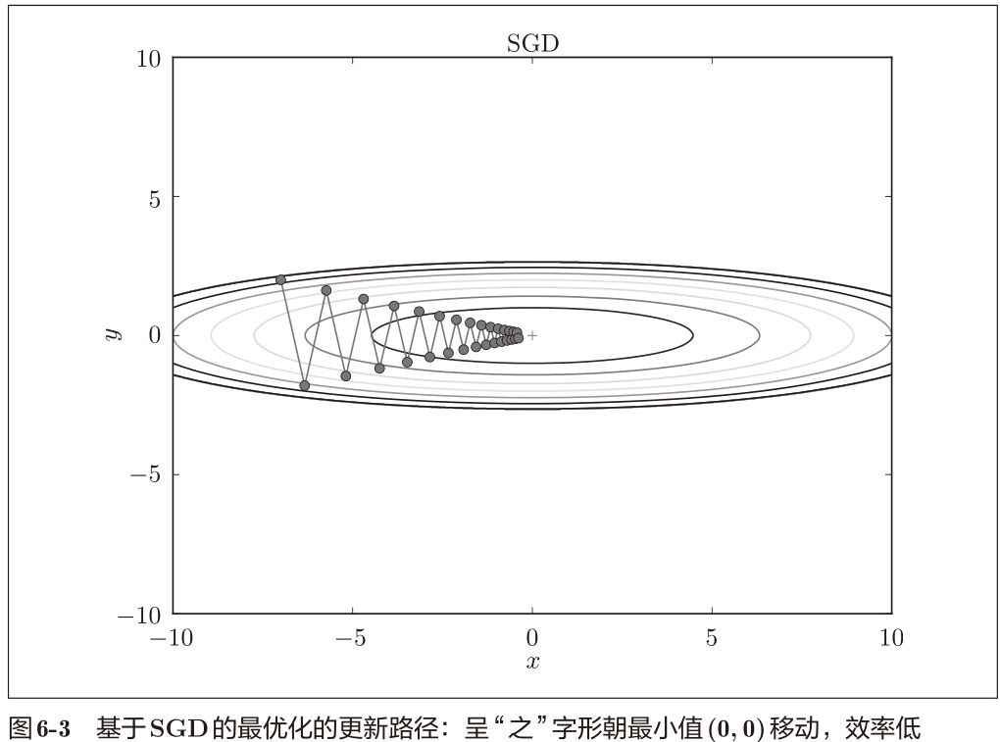
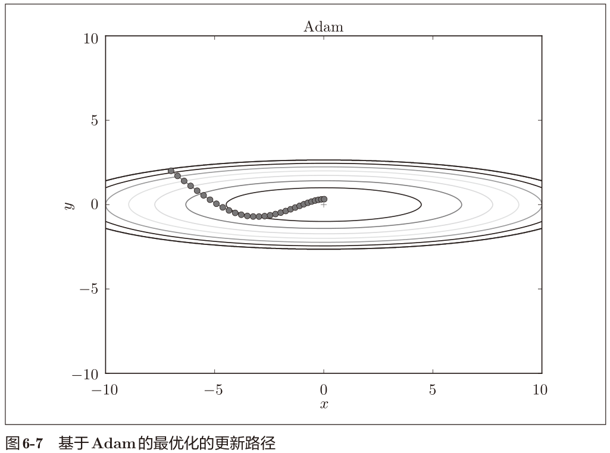
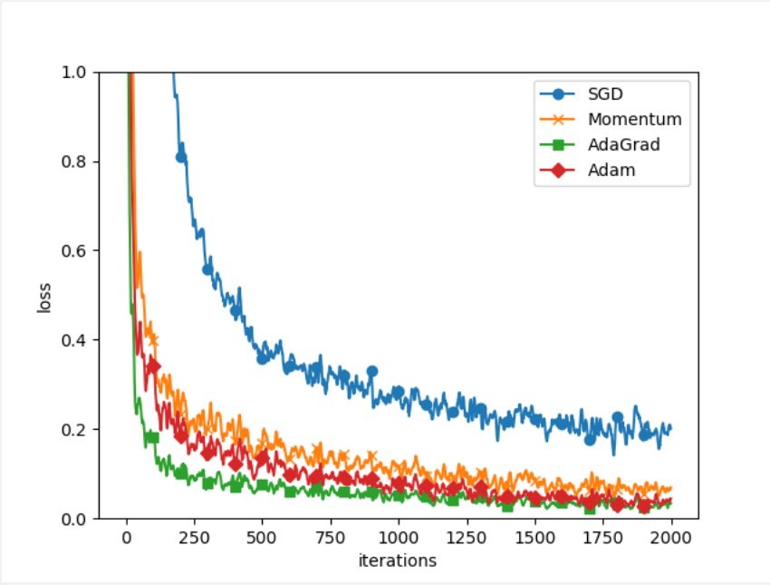

## 与学习相关的技巧

### 参数的更新

> 神经网络的学习的目的是找到使损失函数的值尽可能小的参数。

事实： 神经网络的最优化问题非常难。这是因为参数空间非常复杂，无法轻易找到
最优解。

随机梯度下降法（stochastic gradient descent），
简称SGD。SGD是一个简单的方法，不过比起胡乱地搜索参数空间，也算是“聪
明”的方法。

#### SGD

$$
\boldsymbol{W} \leftarrow \boldsymbol{W}-\eta \frac{\partial L}{\partial \boldsymbol{W}}
$$

式中，需要更新的权重参数记为W，把损失函数关于W的梯度记为$\frac{\partial L}{\partial W} $ 。
η表示学习率，实际上会取0.01或0.001这些事先决定好的值。

#### SGD的缺点

思考这个公式
$$
f(x, y)=\frac{1}{20} x^{2}+y^{2}
$$
直观上感觉，也就是梯度特征是：y轴方向上大，x轴方向上小。因为x前面有个系数1/20.


上图是Z轴的俯视图。

从(x, y) = (−7.0, 2.0)处
（初始值）开始搜索，结果如图6-3所示。



**SGD低效的根本原因是，梯度的方向并没有指向最小值的方向。**

#### Momentum

Momentum是“动量”的意思，和物理有关。
$$
\begin{array}{c}
\boldsymbol{v} \leftarrow \alpha \boldsymbol{v}-\eta \frac{\partial L}{\partial \boldsymbol{W}} \tag{6.3}
\end{array}
$$
$$
\begin{array}
\boldsymbol{W} \leftarrow \boldsymbol{W}+\boldsymbol{v} 
\end{array} \tag{6.4}
$$
W表示要更新的权重参数，
$\frac{\partial L}{\partial W}$ 表示损失函数关于W的梯度，η表示学习率。这里新出现了一个变量v，对应物理上的速度。

式（6.3）表示了物体在梯度方向上受力，在这个力的作用下，物体的速度增
加这一物理法则.

式（6.3）中有αv这一项。在物体不受任何力时，该项承担使物体逐渐减
速的任务（α设定为0.9之类的值）,对应物理上的地面摩擦或空气阻力.

代码描述

```python
class Momentum:
    """Momentum SGD"""

    def __init__(self, lr=0.01, momentum=0.9):
        self.lr = lr
        self.momentum = momentum  # α
        self.v = None

    def update(self, params, grads):
        if self.v is None:
            self.v = {}
            for key, val in params.items():
                self.v[key] = np.zeros_like(val)

        for key in params.keys():
            self.v[key] = self.momentum * self.v[key] - self.lr * grads[key]
            params[key] += self.v[key]
```

新路径就像小球在碗中滚动一样。和SGD相比，“之”字形的“程度”减轻了。因为虽然x轴方向上受到的力非常小，但
是一直在同一方向上受力，所以朝同一个方向会有一定的加速。反过来，虽
然y轴方向上受到的力很大，但是因为交互地受到正方向和反方向的力，它们会互相抵消，所以y轴方向上的速度不稳定。因此，和SGD时的情形相比，
可以更快地朝x轴方向靠近，减弱“之”字形的变动程度.


#### AdaGrad

在神经网络的学习中，学习率（数学式中记为η）的值很重要。学习率过小，
会导致学习花费过多时间；反过来，学习率过大，则会导致学习发散而不能
正确进行。

有一种被称为学习率衰减（learning rate
decay）的方法，即随着学习的进行，使学习率逐渐减小。实际上，一开始“多”
学，然后逐渐“少”学的方法，在神经网络的学习中经常被使用。

AdaGrad会为参数的每个元素适当地调整学习率，与此同时进行学习。
$$
\begin{array}{l}
\boldsymbol{h} \leftarrow \boldsymbol{h}+\frac{\partial L}{\partial \boldsymbol{W}} \odot \frac{\partial L}{\partial \boldsymbol{W}} \\
\boldsymbol{W} \leftarrow \boldsymbol{W}-\eta \frac{1}{\sqrt{\boldsymbol{h}}} \frac{\partial L}{\partial \boldsymbol{W}}
\end{array}
$$
$\odot$ 表示矩阵元素的乘法。W表示要更新的权重参数，
$\frac{\partial L}{\partial W}$ 表示损失函数关于W的梯度，η表示学习率。这里新出现了变量h，它保存了以前的所有梯度值的平方和。

在更新参数时，通过乘以$\frac{1}{\sqrt{h} } $
，就可以调整学习的尺度。h越大，反映在$\frac{1}{\sqrt{h} } $就越小。也就是

> 可以按参数的元素进行学习率衰减，使变动大的参数的学习率逐渐减小。

> AdaGrad会记录过去所有梯度的平方和。因此，学习越深入，更新
> 的幅度就越小。实际上，如果无止境地学习，更新量就会变为 0，
> 完全不再更新。为了改善这个问题，可以使用 RMSProp方法。

代码描述

```python
class AdaGrad:
    """AdaGrad"""

    def __init__(self, lr=0.01):
        self.lr = lr
        self.h = None

    def update(self, params, grads):
        if self.h is None:
            self.h = {}
            for key, val in params.items():
                self.h[key] = np.zeros_like(val)

        for key in params.keys():
            self.h[key] += grads[key] * grads[key]
            params[key] -= self.lr * grads[key] / (np.sqrt(self.h[key]) + 1e-7)
```

注意这里的`np.sqrt(self.h[key]) + 1e-7)`，防止当
self.h[key]中有0时，将0用作除数的情况。


分析：

由于y轴方
向上的梯度较大，因此刚开始变动较大，但是后面会根据这个较大的变动按
比例进行调整，减小更新的步伐。因此，y轴方向上的更新程度被减弱，
“之”
字形的变动程度有所衰减。

#### Adam

Momentum参照小球在碗中滚动的物理规则进行移动，AdaGrad为参
数的每个元素适当地调整更新步伐.

Adam是2015年提出的新方法。它的理论有些复杂，直观地讲，就是融
合了Momentum和AdaGrad的方法.

> 通过组合前面两个方法的优点，有望
> 实现参数空间的高效搜索。此外，进行超参数的“偏置校正”也是Adam的特征。

具体实现请参考原论文和该项目代码src.common.optimizer.Adam。



#### 使用哪种更新方法

并不存在能在所有问题中都表现良好
的方法。这4种方法各有各的特点，都有各自擅长解决的问题和不擅长解决
的问题.

#### 基于MNIST数据集的更新方法的比较



与SGD相比，其他3种方法学习得更快，而且
速度基本相同，仔细看的话，AdaGrad的学习进行得稍微快一点。

### 权重的初始值

